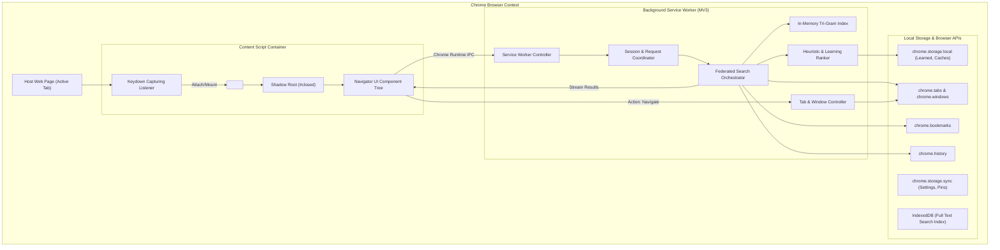
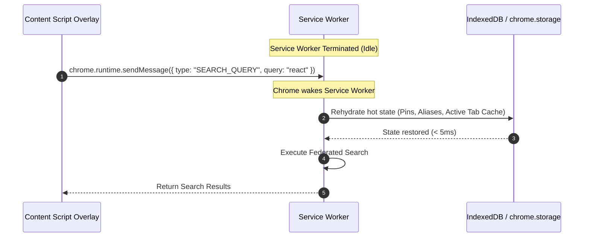

# 00. Overview & System Architecture

> **Document ID**: SPEC-00  
> **Status**: Normative  
> **Covers Requirements**: #1, #2, #3, #50, #51, #181, #190, #191, #288, #289, #290, #291, #292, #300  

---

## 1. Product Vision & Core Tenets

**Chrome Navigator** is a fast, keyboard-first universal command palette and navigator for Google Chrome. It collapses the fragmented information spaces in the browser into a single unified interface that can be summoned instantly from any webpage.

### 1.1 Product Philosophy

$$\text{Open} \longrightarrow \text{Type} \longrightarrow \text{Navigate}$$

Every design and architectural decision is governed by seven core tenets:

1. **Keyboard-First**: Every action, filter, navigation target, and configuration setting must be operable without a mouse.
2. **Minimal Interaction**: Maximum information throughput with minimum keystrokes. Single-stroke activation, instant feedback.
3. **Sub-Frame Latency**: The palette must render within 50ms of invocation, and search keystrokes must update within 16ms (60 FPS budget).
4. **Local-First & Privacy-First**: All indexing, searching, fuzzy matching, and ranking occur locally on the user's device. No browsing data leaves the machine.
5. **Zero Duplicate Tabs**: When a destination is already open in any window, Navigator activates and focuses the existing tab rather than spawning duplicates.
6. **Low Cognitive Load**: Clean, predictable results with clear source provenance, intelligent deduplication, and minimal visual noise.
7. **Offline Independence**: The core navigator functions identically whether the user has gigabit internet or zero network connectivity.

### 1.2 Core Differentiators

Unlike generic application launchers or basic tab switchers, Chrome Navigator delivers deep browser-native synthesis:
- **Universal Multi-Source Search**: Concurrent querying across open tabs, bookmarks, browsing history, pinned items, and custom commands.
- **Smart Existing-Tab Detection**: Heuristic tab matching (exact, path, origin, or domain) across all Chrome windows.
- **Custom Scopes & Aliases**: User-definable slash commands (e.g. `/jira`, `/gh`, `GH`) that map to domains, URL patterns, or action pipelines.
- **URL Semantics Control**: Modifier tokens (`@query` vs `@domain`) giving users explicit control over URL depth.
- **Local Learned Ranking**: Lightweight frequency and recency feedback loops that learn user habits without machine learning overhead or cloud telemetries.

---

## 2. Core Product Concept

Chrome Navigator combines the best attributes of modern desktop command bars (Raycast, Spotlight, Alfred) and browser-native subsystems (Omnibox, Chrome Tab Search, Bookmark Manager) directly within the web page context.

```text
┌────────────────────────────────────────────────────────────────────────┐
│  > Search tabs, bookmarks, history, and commands...                    │
├────────────────────────────────────────────────────────────────────────┤
│  ⚡ GitHub — chrome-extension-navigator                           TAB   │
│     github.com/company/chrome-extension-navigator       [Window 1]     │
│                                                                        │
│  ★  GitHub: Where the world builds software                       BM   │
│     github.com                                          /Development   │
│                                                                        │
│  🕒 Pull Request #42: Add Fuzzy Matching Pipeline              HISTORY │
│     github.com/company/chrome-extension-navigator/pull/42              │
├────────────────────────────────────────────────────────────────────────┤
│  ↵ Open    ⌥↵ New Tab    ⇧↵ Background    ⌘K Actions    esc Dismiss    │
└────────────────────────────────────────────────────────────────────────┘
```

---

## 3. Chrome Extension Architecture (Manifest V3)

The extension is designed around Google Chrome's Manifest V3 architecture, which introduces an ephemeral background service worker model and strict Content Security Policies.



### 3.1 Component Breakdown

1. **Content Script Layer (`content-script.js`)**:
   - Injected into all web origins (`<all_urls>`).
   - Listens on `window` capture phase for invocation shortcuts (`Shift+O`).
   - Evaluates active DOM node to suppress invocation while user is typing in form fields or code editors.
   - Instantiates a host element containing a **closed Shadow Root** (`Element.attachShadow({ mode: 'closed' })`) to guarantee total CSS and DOM isolation from host website scripts.

2. **Background Service Worker (`background.js`)**:
   - The central orchestrator running in an isolated background thread.
   - Coordinates multi-source searches across `chrome.tabs`, `chrome.bookmarks`, and `chrome.history`.
   - Maintains an ephemeral in-memory index for instant tab and bookmark lookup.
   - Rehydrates its state transparently from `chrome.storage` and `IndexedDB` upon wake-up after worker idle suspension.

3. **Persistence Engine**:
   - `chrome.storage.sync`: Synchronizes user settings, custom aliases, domain rules, and pins across logged-in Chrome browser profiles (quota: 100KB).
   - `chrome.storage.local`: Stores local frequency counters, recent selection histories, and decay parameters (quota: 10MB).
   - `IndexedDB` (`navigator_db`): Stores inverted n-gram search indices for fast client-side substring and token matching across large bookmark trees (10,000+) and browsing histories (50,000+).

4. **Omnibox & Context Menu Integration**:
   - Registers Chrome Omnibox trigger keyword `nav`.
   - Enables users to initiate searches directly from Chrome's primary address bar.
   - Adds right-click context menu options for quick-pinning pages or creating aliases.

---

## 4. Service Worker Lifecycle & State Recovery

Manifest V3 background service workers terminate after ~30 seconds of inactivity. Chrome Navigator treats background memory as purely ephemeral cache.



### 4.1 Rehydration Strategy

- **Cold Start Budget**: Rehydration from storage must complete in $< 10\text{ms}$.
- **Immutable In-Memory Cache**: Active tabs are updated via event listeners (`chrome.tabs.onCreated`, `chrome.tabs.onUpdated`, `chrome.tabs.onRemoved`).
- **Snapshot Persisting**: When tabs mutate, lightweight diffs are committed to memory and flushed to session storage asynchronously.

---

## 5. Search Session Lifecycle

Every invocation of the command palette establishes an isolated search session identified by a monotonic session UUID and sequence counter.

```typescript
export interface SearchSession {
  sessionId: string;          // UUID v4 uniquely identifying overlay invocation
  openedAt: number;           // Unix epoch timestamp (ms)
  activeTabId: number;        // ID of tab where Navigator was invoked
  activeWindowId: number;     // ID of window where Navigator was invoked
  currentOrigin: string;      // Origin of host page (e.g., "https://github.com")
  monotonicRequestId: number; // Incrementing counter for every keystroke in session
  lastQuery: string;          // Current raw query string
  isTerminated: boolean;      // True if overlay was closed or navigated away
}
```

### 5.1 Race Condition & Async Cancellation

To eliminate race conditions caused by typing faster than asynchronous search pipelines can return:
1. Every outgoing IPC query carries `monotonicRequestId`.
2. When the UI dispatches request $N+1$, an `AbortController` signals cancellation of pending promises for request $N$.
3. When the service worker returns results for request $N$, the UI verifies that `response.requestId === session.monotonicRequestId`. If stale, the results are discarded immediately.

---

## 6. Network Independence & Offline Guarantees

Chrome Navigator enforces a strict **Zero-Network Dependency Contract**:

- **No Remote Network Calls for Core Operations**: Tab retrieval, bookmark searching, history traversal, alias expansion, command execution, and math parsing execute purely using local browser APIs and in-memory caches.
- **Offline Startup Guarantee**: The overlay must instantiate and reach fully interactive search state in 0ms network latency conditions (e.g. offline airplane mode).
- **Graceful Network Degradation**: If third-party integrations (e.g., Jira API, GitHub API as specified in Document 14) are configured by the user, network errors or timeouts are isolated exclusively to the remote integration provider and never stall local browser search results.

---

## 7. Core System Data Types

```typescript
export type ResourceSource = 
  | 'tab' 
  | 'bookmark' 
  | 'history' 
  | 'pin' 
  | 'command' 
  | 'recent' 
  | 'remote';

export type NavigationMode = 'query' | 'domain' | 'exact';

export interface CanonicalResource {
  id: string;                      // Deterministic hash of canonical URL or command key
  canonicalUrl: string;            // Sanitized, deduplicated URL
  displayUrl: string;              // Pretty URL for rendering
  title: string;                   // Clean page or bookmark title
  sources: ResourceSource[];       // Multi-source presence (e.g. ['tab', 'bookmark'])
  
  // Tab metadata (if open)
  tabId?: number;
  windowId?: number;
  windowIndex?: number;
  isAudible?: boolean;
  isMuted?: boolean;
  isPinnedTab?: boolean;
  isDiscarded?: boolean;

  // Bookmark metadata (if bookmarked)
  bookmarkId?: string;
  folderPath?: string[];

  // History metadata (if in history)
  visitCount?: number;
  lastVisitTime?: number;

  // Calculated ranking signals
  score: number;
  matchHighlights: {
    titleIndices: [number, number][];
    urlIndices: [number, number][];
  };
}
```
