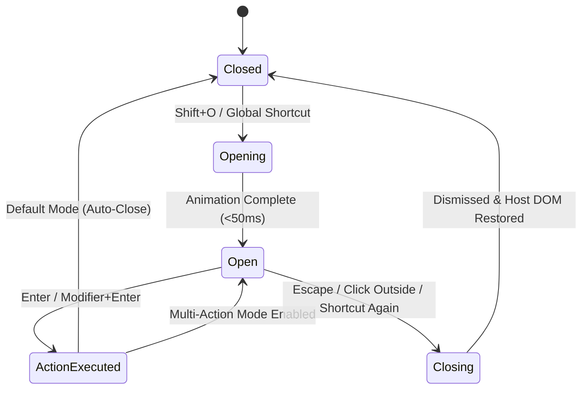

# 01. Invocation, Overlay & Web Compatibility

> **Document ID**: SPEC-01  
> **Status**: Normative  
> **Covers Requirements**: #4, #5, #6, #7, #8, #9, #10, #144, #145, #146, #147, #148, #149, #150, #151, #162, #163, #164, #165, #166, #167, #168, #169, #170, #171, #172, #173, #240, #263, #264, #265, #266  

---

## 1. Primary Invocation Shortcut & Keystroke Filtering

The default in-page shortcut to summon Chrome Navigator is:

$$\mathbf{Shift + O}$$

### 1.1 Active Element Filtering

To prevent intercepting standard user text input while typing on web applications, the content script evaluates the active DOM element on every `keydown` event in the **capturing phase** (`window.addEventListener('keydown', handler, true)`).

Invocation is **strictly suppressed** if `document.activeElement` or any element along the event path matches any of the following criteria:

1. **Standard HTML Form Controls**:
   - `HTMLInputElement` (except buttons, checkboxes, radio buttons)
   - `HTMLTextAreaElement`
   - `HTMLSelectElement`
2. **Rich Text & Contenteditable Nodes**:
   - Elements where `isContentEditable === true`
   - Elements with `contenteditable="true"` or `contenteditable="plaintext-only"`
3. **WAI-ARIA Text Input Roles**:
   - Elements where `role` attribute is `"textbox"`, `"searchbox"`, `"combobox"`, or `"spinbutton"`
4. **Code Editors & Document Canvas Wrappers**:
   - Monaco Editor (`.monaco-editor`, `.view-lines`)
   - CodeMirror 5/6 (`.CodeMirror`, `.cm-content`)
   - ProseMirror (`.ProseMirror`)
   - TipTap / Slate (`[data-slate-editor="true"]`)
   - Ace Editor (`.ace_editor`)
   - Notion block editors (`[data-content-editable-leaf="true"]`)
   - Google Docs / Sheets canvas editors (`.kix-canvas-tile-content`, `canvas.inner-box`)

```typescript
export function isTypingContext(target: EventTarget | null): boolean {
  if (!(target instanceof HTMLElement)) return false;
  
  if (target.isContentEditable) return true;
  
  const tagName = target.tagName.toUpperCase();
  if (tagName === 'TEXTAREA' || tagName === 'SELECT') return true;
  if (tagName === 'INPUT') {
    const nonTextTypes = ['checkbox', 'radio', 'button', 'submit', 'reset', 'range', 'color'];
    const inputType = (target as HTMLInputElement).type.toLowerCase();
    if (!nonTextTypes.includes(inputType)) return true;
  }
  
  const role = target.getAttribute('role');
  if (role && ['textbox', 'searchbox', 'combobox', 'spinbutton'].includes(role.toLowerCase())) {
    return true;
  }
  
  // Verify nearest editor parent container
  if (target.closest('.monaco-editor, .CodeMirror, .cm-editor, .ProseMirror, [data-slate-editor="true"]')) {
    return true;
  }
  
  return false;
}
```

---

## 2. Browser-Level Global Shortcuts & Conflict Arbitration

In addition to in-page content script listening, Chrome Navigator registers a browser-level global shortcut via the Chrome Commands API in `manifest.json`:

```json
{
  "commands": {
    "toggle-navigator": {
      "suggested_key": {
        "default": "Ctrl+Shift+O",
        "mac": "Command+Shift+O"
      },
      "description": "Toggle Chrome Navigator Command Palette"
    }
  }
}
```

### 2.1 Web Application Conflict Arbitration

Certain web applications (e.g. Figma, Google Docs, VS Code Web) bind `Shift+O` or similar combinations for their own actions. Chrome Navigator provides three conflict resolution modes:

1. **Global Browser Priority**: Browser command (`Cmd/Ctrl+Shift+O`) bypasses web page DOM listeners entirely.
2. **Domain Exclusion Whitelist/Blacklist**: Disables the in-page `Shift+O` shortcut on designated domains (e.g. `figma.com`, `docs.google.com`), reserving activation exclusively for the browser shortcut.
3. **Per-Domain Custom Shortcuts**: Users can rebind in-page activation to alternative chords (e.g. `Alt+Space` or `Shift+Escape`) for specific websites.

---

## 3. Toggle Lifecycle & State Transitions

The overlay operates under a strict deterministic finite-state machine (FSM):



### 3.1 Overlay Persistence (Multi-Action Mode)

By default, executing a navigation action automatically dismisses the overlay. If **Overlay Persistence** is toggled on (`settings.keepOpenAfterAction === true`), the palette remains visible after non-closing operations (such as closing another tab, muting an audible tab, or copying markdown), allowing rapid sequential batch operations.

---

## 4. Overlay Injection & DOM Isolation

To prevent host page CSS from corrupting Navigator's interface and to ensure Navigator's CSS cannot bleed into the host page, the UI is rendered within a **Closed Shadow Root**.

```typescript
// Injection lifecycle
const hostElement = document.createElement('chrome-navigator-host');
hostElement.style.all = 'initial'; // Reset CSS inheritance
const shadowRoot = hostElement.attachShadow({ mode: 'closed' });

// Mount React/Preact component tree
render(<CommandPalette root={shadowRoot} />, shadowRoot);
```

### 4.1 Z-Index & Stacking Strategy

Web applications frequently use extreme `z-index` values ($2^{31}-1 = 2147483647$).
- Navigator host element sets:
  ```css
  chrome-navigator-host {
    position: fixed !important;
    top: 0 !important;
    left: 0 !important;
    width: 100vw !important;
    height: 100vh !important;
    z-index: 2147483647 !important;
    pointer-events: auto !important;
  }
  ```
- Uses modern CSS `@layer` resets inside the shadow root to guarantee zero rule collisions.
- Incorporates `contain: layout style paint` on the container to optimize browser rendering performance.

---

## 5. Positioning, Geometry & Responsive Layout

### 5.1 Vertical & Horizontal Placement

Extensive ergonomic studies in command palette design demonstrate that centering on screen causes excessive eye travel. Chrome Navigator positions the palette:
- **Horizontally**: Perfectly centered (`left: 50%; transform: translateX(-50%)`).
- **Vertically**: Positioned between **15% and 25%** from the top of the viewport (default: `top: 18vh`).

```text
┌─────────────────────────────────────────────────────────────┐
│ Viewport Top                                                │
│                                                             │
│              ◄──────── 18% Viewport Height ────────►        │
│                                                             │
│         ┌─────────────────────────────────────────┐         │
│         │  🔍 Search tabs, bookmarks, history...  │         │
│         ├─────────────────────────────────────────┤         │
│         │  Result Row 1                           │         │
│         │  Result Row 2                           │         │
│         │  Result Row 3                           │         │
│         └─────────────────────────────────────────┘         │
│                                                             │
│ Viewport Bottom                                             │
└─────────────────────────────────────────────────────────────┘
```

### 5.2 Responsive Overlay Widths

Users can configure overlay width according to screen real estate:
- **Compact**: $540\text{px}$ (ideal for laptops or small screens)
- **Normal (Default)**: $640\text{px}$ (optimal balance for title + URL display)
- **Wide**: $760\text{px}$ (maximum visibility for deep paths and breadcrumbs)
- **Viewport Fallback**: `max-width: calc(100vw - 32px)`

---

## 6. Overlay Dismissal Triggers

The overlay is immediately dismissed upon any of the following events:
1. Pressing `Escape` (configurable: first clear search query if non-empty, second press dismisses; or instant dismiss).
2. Clicking anywhere on the backdrop overlay outside the palette boundary (`pointerdown` event).
3. Striking the invocation shortcut (`Shift+O` or `Ctrl/Cmd+Shift+O`) while the palette is open.
4. Window blur / Tab switch (configurable via setting `closeOnWindowBlur`).

Upon dismissal:
- The Shadow DOM host is removed from the DOM or unmounted.
- Focus is cleanly restored to the previously focused DOM element prior to invocation.

---

## 7. Search Input Mechanics & Autofocus

1. **Sub-millisecond Focus**: Immediately upon mount, `HTMLInputElement.focus({ preventScroll: true })` is invoked.
2. **Text Selection**: Any initial text (or preserved query) is fully selected so subsequent typing replaces it instantly.
3. **Host Event Cancellation**: `keydown`, `keyup`, and `keypress` events on the search input stop propagation (`e.stopPropagation()`) to prevent page listeners from intercepting characters.

---

## 8. Accessibility & WCAG 2.1 AA Compliance

Chrome Navigator complies strictly with WCAG 2.1 Level AA accessibility standards.

### 8.1 ARIA Combobox Architecture

The palette implements the **WAI-ARIA Combobox Pattern (1.2)**:
- Search input has:
  - `role="combobox"`
  - `aria-autocomplete="list"`
  - `aria-expanded="true"`
  - `aria-controls="navigator-results-list"`
  - `aria-activedescendant="result-option-{activeId}"`
- Results container has:
  - `role="listbox"`
  - `id="navigator-results-list"`
- Each item has:
  - `role="option"`
  - `id="result-option-{id}"`
  - `aria-selected="true|false"`
- Includes an invisible `aria-live="polite"` region announcing result count and status (e.g. `"12 results found. Tab GitHub selected."`).

### 8.2 Keyboard Containment / Trap

While open, the palette traps `Tab` and `Shift+Tab` keys within the palette controls (Input $\leftrightarrow$ Result List $\leftrightarrow$ Action Menu) to prevent focus from escaping into the host webpage behind the backdrop.

---

## 9. CJK & IME Composition Event Handling

To support international input (Japanese, Chinese, Korean, Vietnamese, etc.):
- Listens to `compositionstart`, `compositionupdate`, and `compositionend` events on the search input.
- While `isComposing === true`:
  - Striking `Enter` commits the IME composition string and **does not** trigger item navigation.
  - Arrow keys navigate IME candidate menus and **do not** change palette item selection.
  - Search engine queries are evaluated after `compositionend`.

---

## 10. Web Host Interoperability & Restricted Pages

### 10.1 Restricted Chrome Pages

Chrome security policies prevent content script execution on:
- `chrome://*` (Chrome internals, history, settings)
- `chrome-extension://*` (Extension option pages)
- `devtools://*` (Developer tools)
- `https://chrome.google.com/webstore/*` (Chrome Web Store)

On these pages, the in-page `Shift+O` shortcut cannot run. The global browser shortcut (`Cmd/Ctrl+Shift+O`) responds by opening Navigator in a lightweight popup or dedicated floating dialog tab.

### 10.2 Single Page Application (SPA) Routing Resilience

Single Page Applications (React, Vue, Angular, Svelte, Next.js) constantly modify browser history via `history.pushState` and `replaceState`.
- Navigator attaches its DOM listeners at the document root level.
- Route mutations by the host page do not detach or disrupt Navigator.

---

## 11. Fullscreen & Cross-Origin Iframes

### 11.1 Fullscreen Handling

When a web page enters fullscreen mode (`document.fullscreenElement !== null`):
- Injecting the overlay into `document.body` causes it to be hidden behind the fullscreen canvas or video element.
- Navigator dynamically detects `document.fullscreenElement` and attaches `chrome-navigator-host` directly inside the fullscreen element so the palette remains fully visible over videos, slide presentations, and games.

### 11.2 Iframe Traversal

Content scripts are injected into subframes (`"all_frames": true`). However, only the top frame (`window.self === window.top`) or the currently active focused frame renders the overlay to prevent duplicate palettes from appearing simultaneously.

---

## 12. Domain Exclusions & Shortcut Customization

```typescript
export interface DomainExclusionConfig {
  domain: string;                   // Pattern (e.g. "figma.com", "*.google.com")
  disableInPageShortcut: boolean;   // Suppress Shift+O
  customShortcut?: string;          // Optional replacement (e.g. "Alt+Space")
}
```

When visiting a domain matching `domain`, the content script automatically deactivates the in-page listener or binds to `customShortcut`. The browser-level command remains always active.
