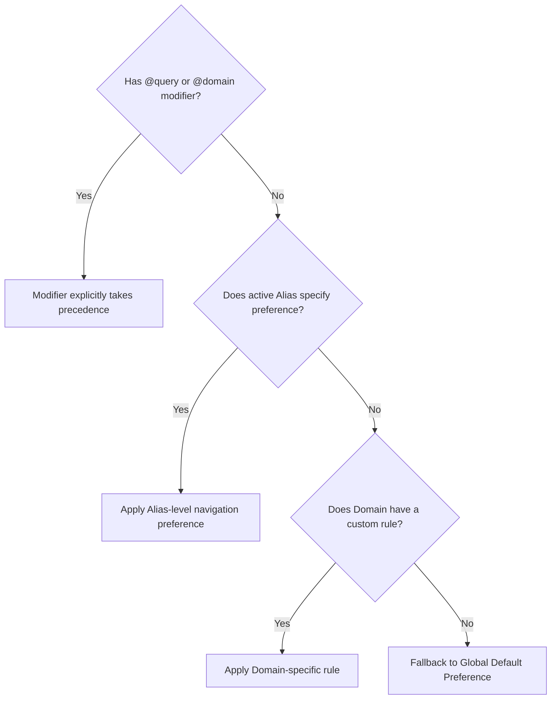

# 02. Query Syntax, Lexer & AST Parser

> **Document ID**: SPEC-02  
> **Status**: Normative  
> **Covers Requirements**: #14, #15, #16, #17, #18, #19, #20, #21, #22, #23, #26, #27, #28, #30, #194, #195, #196, #197, #198, #199, #200, #201, #202, #203, #204, #231, #270, #285, #286, #287  

---

## 1. Formal Query Grammar & Lexer Architecture

The Chrome Navigator search input parses structured queries into a typed Abstract Syntax Tree (AST). The parser supports order-independent modifiers, scopes, aliases, filters, quoted literals, and negation tokens.

### 1.1 Extended Backus-Naur Form (EBNF)

```ebnf
Query            ::= ( Token WS* )*
Token            ::= ModifierToken
                   | ScopeToken
                   | AliasToken
                   | FilterToken
                   | QuotedToken
                   | NegationToken
                   | EscapedToken
                   | TextToken

ModifierToken    ::= "@" ( "query" | "domain" | "exact" )
ScopeToken       ::= "/" ( "tab" | "t" | "bm" | "bookmark" | "history" | "ht" | "pin" | "pinned" | "recent" | "cmd" )
AliasToken       ::= "/" Identifier | HeadPrefix WS
FilterToken      ::= ( "domain:" | "source:" | "tag:" ) Value
QuotedToken      ::= '"' [^"]* '"'
NegationToken    ::= "-" Word
EscapedToken     ::= "\" AnyChar
TextToken        ::= Word

Identifier       ::= [a-zA-Z0-9_-]+
Word             ::= [^\s]+
WS               ::= " " | "\t"
```

### 1.2 Parsed AST Data Structures

```typescript
export interface ParsedQueryAST {
  rawInput: string;
  normalizedQuery: string;        // Clean text tokens without syntax operators
  navigationModifier?: 'query' | 'domain' | 'exact';
  scope?: 'tab' | 'bookmark' | 'history' | 'pin' | 'recent' | 'command';
  activeAlias?: CustomAliasDefinition;
  domainFilters: string[];        // Explicit domain restrictions
  tagFilters: string[];           // Tag restrictions
  exactPhrases: string[];         // From quoted strings ("pull request")
  negatedTerms: string[];         // Excluded words (-draft)
  searchTokens: string[];         // Tokenized keywords for fuzzy/relevance scoring
  isLiteralSearch: boolean;       // Escaped slashes or quotes
}
```

---

## 2. Concrete Parsing Walkthroughs

The parser is permissive and flexible: token ordering is non-rigid.

### Example A: Navigation Modifier + Custom Alias + Query
- **Input**: `@domain /jira login bug`
- **Parsed AST**:
  ```json
  {
    "navigationModifier": "domain",
    "activeAlias": { "name": "Jira", "domains": ["*.atlassian.net", "jira.company.com"] },
    "searchTokens": ["login", "bug"],
    "normalizedQuery": "login bug"
  }
  ```

### Example B: Non-Rigid Order with Negation
- **Input**: `/history @query jira -sprint`
- **Parsed AST**:
  ```json
  {
    "scope": "history",
    "navigationModifier": "query",
    "searchTokens": ["jira"],
    "negatedTerms": ["sprint"],
    "normalizedQuery": "jira"
  }
  ```

### Example C: Quoted Exact Substring
- **Input**: `/tab "pull request #42" review`
- **Parsed AST**:
  ```json
  {
    "scope": "tab",
    "exactPhrases": ["pull request #42"],
    "searchTokens": ["review"],
    "normalizedQuery": "\"pull request #42\" review"
  }
  ```

---

## 3. Data-Driven Scope Registry & Configurable Built-in Scopes

Built-in scopes restrict candidate search sources. Rather than being hardcoded into parser logic, scopes are managed via a **Data-Driven Scope Registry** initialized with sensible defaults that users can freely customize or rebind in settings:

```typescript
export interface ScopeDefinition {
  id: 'tab' | 'bookmark' | 'history' | 'pin' | 'recent' | 'command' | 'audio';
  name: string;
  description: string;
  defaultTriggers: string[];
  userTriggers: string[];    // User-customizable triggers (e.g. ["/o", "/tab"])
  isSystem: boolean;        // System providers cannot be deleted, but triggers can be changed
  enabled: boolean;
}
```

### Default Scope Registry Table

| Scope Identifier | Default Triggers | Customizable | Target Data Source |
| :--- | :--- | :---: | :--- |
| `tab` | `/tab`, `/t` | Yes | Only currently open browser tabs (across all windows) |
| `bookmark` | `/bm`, `/b`, `/bookmark` | Yes | Chrome bookmark tree |
| `history` | `/history`, `/ht` | Yes | Local browsing history entries |
| `pin` | `/pin`, `/pinned` | Yes | Chrome Navigator user-pinned items |
| `recent` | `/recent` | Yes | Recently accessed items in Navigator |
| `command` | `/cmd`, `>` | Yes | Browser management actions & tools |
| `audio` | `/audio` | Yes | Currently audible or muted tabs |

### 3.1 Unknown Slash Command Fallback

If a user types a slash command that is neither a built-in scope nor a registered custom alias (e.g. `/unknown query`):
- The parser **does not throw an error** or show an empty state.
- It treats `/unknown` as a standard literal search keyword, searching titles and URLs containing the string `/unknown` or `unknown`.

### 3.2 Escaped Slash Tokens

If a user explicitly wants to search for a URL containing a slash (e.g. searching for a path segment):
- Prepending a backslash (`\/jira`) causes the parser to bypass scope/alias evaluation and treat `/jira` as literal text.

---

## 4. Custom Domain Scopes & Multi-Domain Mapping

Users can define custom slash scopes that constrain searching to specific web services and automatically associate custom domains.

```typescript
export interface CustomAliasDefinition {
  id: string;
  name: string;                   // Display label (e.g. "GitHub")
  triggers: string[];             // Triggers: ["/gh", "/github", "GH", "gh"]
  domains: string[];              // Matched hostnames (e.g. ["github.com", "gist.github.com"])
  urlPatterns?: string[];         // Wildcard paths (e.g. ["github.com/company/*"])
  defaultNavigation: 'default' | 'query' | 'domain';
  iconUrl?: string;
  color?: string;
  enabled: boolean;
}
```

### 4.1 Multi-Domain Scoping Example

A single alias `/google` can bind to multiple related properties:
- `google.com`
- `docs.google.com`
- `drive.google.com`
- `mail.google.com`

When active, candidate results are strictly filtered to those domains.

---

## 5. Custom Trigger Prefixes & Head-Anchoring

Users may configure plain text prefixes (without leading slashes) to trigger aliases.

### 5.1 Case Insensitivity

Custom prefixes are evaluated case-insensitively:
$$\text{"GH react"} \equiv \text{"gh react"} \equiv \text{"Gh react"}$$

### 5.2 Head-Anchoring Rule (False-Positive Prevention)

To prevent normal sentences from accidentally triggering aliases, a prefix trigger is **only recognized if it is the very first token in the query**:
- `"GH react hook"` $\longrightarrow$ Triggers GitHub alias (`GH`).
- `"react GH hook"` $\longrightarrow$ Treated as pure search text; `GH` is **not** treated as an alias trigger.

---

## 6. Alias Conflict Resolution & Precedence Rules

When a query could match multiple scopes or aliases, conflicts are resolved deterministically:

1. **System Scopes Override Custom Aliases**: Built-in commands (`/tab`, `/bm`, `/history`) always take absolute precedence over any custom alias claiming the same trigger name.
2. **Longest Token Matching (Greedy Match)**: If multiple custom aliases share common prefixes:
   - Given aliases `/g` (Google) and `/gh` (GitHub) and `/github` (GitHub Full):
   - Input `/gh` matches **GitHub** (length 3 beats length 2).
   - Input `/github` matches **GitHub Full** (length 7 beats length 3).

---

## 7. Search Modifiers Specification

Modifiers instruct the navigation dispatcher how to transform the target destination URL upon activation.

### 7.1 `@query` (Preserve Path & Query Parameters)

- Preserves the full URL path, active query parameters (`?id=ABC-123&view=detail`), and hash fragment.
- Overrides any domain-level default that might otherwise truncate to the root.

### 7.2 `@domain` (Truncate to Root Domain)

- Strips pathname, query string, and hash, reducing the target URL to its root origin:
  $$\text{https://jira.company.com/issues/ABC-123?filter=all} \longrightarrow \text{https://jira.company.com/}$$
- Used when the user wants to navigate to the homepage or main dashboard of a tool rather than a specific sub-item.

### 7.3 Hierarchy of Navigation Preference



---

## 8. Filter Specifiers

Users can express fine-grained attribute filters anywhere in the query string:
- `domain:github.com`: Restricts matches to URLs hosted on `github.com`.
- `source:tabs`: Restricts matches exclusively to open browser tabs.
- `source:history`: Restricts matches exclusively to browsing history.
- `tag:work`: Matches items tagged with `#work`.

---

## 9. Dynamic Autocomplete & Suggestion Pipeline

As the user types, Navigator provides proactive inline suggestions:

```text
┌─────────────────────────────────────────────────────────────┐
│  /g                                                         │
├─────────────────────────────────────────────────────────────┤
│  ⚡ /gh          Search GitHub (github.com)           ALIAS │
│  ⚡ /google      Search Google                        ALIAS │
│  ⚡ /groups      Filter Tab Groups                    SCOPE │
└─────────────────────────────────────────────────────────────┘
```

1. **Scope / Alias Suggestion**: Typing `/` reveals favorite and registered aliases sorted by frequency of use.
2. **Modifier Auto-Prompt**: Typing `@` surfaces `@query`, `@domain`, and `@exact` with descriptions.
3. **Suffix Autocomplete**: If a user frequently searches `/jira PROJ-123`, typing `/jira PRO` displays an inline ghost text suggestion or candidate dropdown item for `PROJ-123`.
4. **Privacy Isolation**: Autocomplete candidates are computed entirely from local browser stores; no keystrokes are transmitted to external suggestion APIs.
