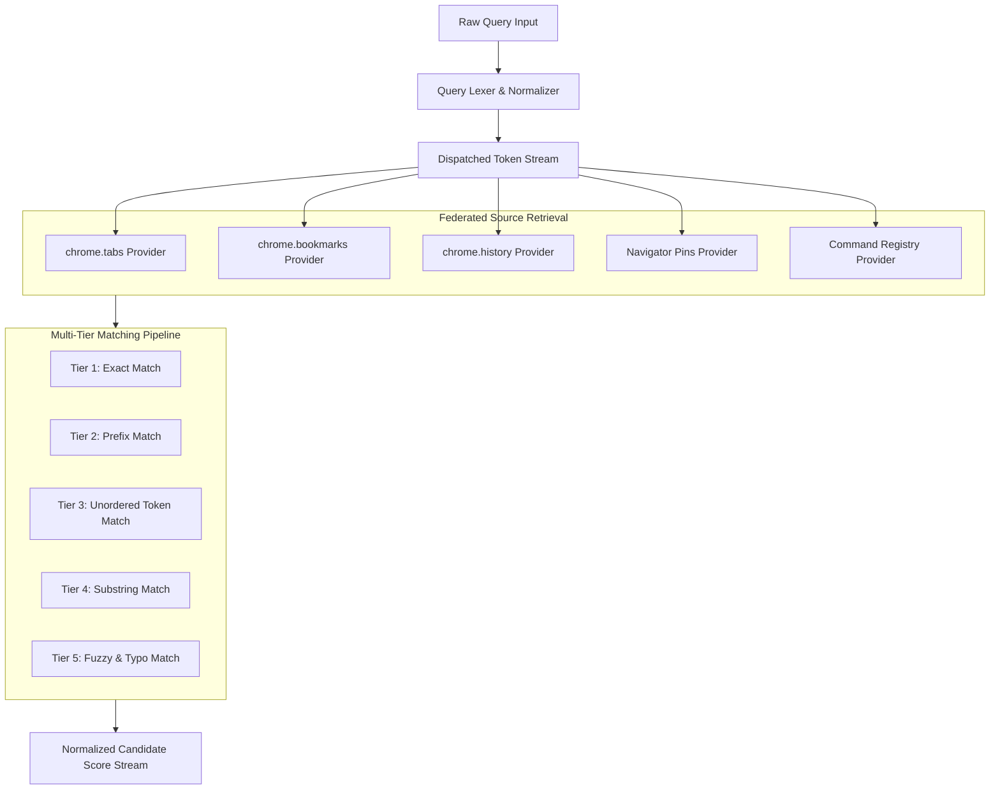

# 03. Search Engine & Multi-Tier Matching Pipeline

> **Document ID**: SPEC-03  
> **Status**: Normative  
> **Covers Requirements**: #10, #11, #12, #24, #25, #34, #35, #36, #37, #38, #39, #40, #111, #114, #246, #253, #254, #255, #256, #257, #258, #278, #279, #280  

---

## 1. Universal Search Architecture

The Chrome Navigator search engine is a **federated, local-first retrieval system** designed to query multiple heterogeneous browser data sources concurrently and synthesize a single, coherently ranked result stream.



---

## 2. Searchable Attribute Schema

Every candidate entity is projected into a normalized document schema before matching:

```typescript
export interface SearchableDocument {
  id: string;
  source: 'tab' | 'bookmark' | 'history' | 'pin' | 'command';
  title: string;
  titleTokens: string[];
  url: string;
  hostname: string;
  domain: string;                 // eTLD+1 (e.g. "github.com")
  pathname: string;
  pathSegments: string[];         // ["company", "project"]
  queryTokens: string[];          // Decoded query parameter values
  folderHierarchy?: string[];     // ["Dev", "Work", "Repos"] (Bookmarks only)
  customKeywords?: string[];      // Configured metadata tags
  acronyms: string[];             // Extracted acronyms (e.g. "SO" for "Stack Overflow")
}
```

---

## 3. Multi-Tier Matching Pipeline

Candidate entities pass through five matching tiers, with earlier tiers contributing significantly higher base match coefficients:

| Tier | Matching Strategy | Base Score ($S_m$) | Example Query $\rightarrow$ Match |
| :---: | :--- | :---: | :--- |
| **1** | **Exact Match** | $1.00$ | `jira` $\rightarrow$ Title `Jira` or Host `jira.com` |
| **2** | **Prefix Match** | $0.85$ | `git` $\rightarrow$ `GitHub`, `GitLab`, `GitBook` |
| **3** | **Word Boundary / Substring** | $0.70$ | `invoice` $\rightarrow$ `Stripe: View Customer Invoice #49` |
| **4** | **Unordered Tokenized** | $0.60$ | `jira login bug` $\rightarrow$ `Login issue [Bug] — Jira Cloud` |
| **5** | **Fuzzy & Typo Tolerant** | $0.30 - 0.50$ | `gthb` $\rightarrow$ `GitHub`; `jra logn` $\rightarrow$ `Jira Login` |

### 3.1 Unordered Token Matching (Tier 4)

When a query contains multiple whitespace-delimited tokens (e.g. `jira login bug`), the engine requires that **all non-negated tokens** match somewhere within the searchable attributes (title, hostname, or path segments), regardless of their sequential order.

### 3.2 Fuzzy Search & Typo Tolerance (Tier 5)

Fuzzy matching uses a modified Smith-Waterman sequence alignment algorithm with bonuses for:
- Sequential contiguous matches.
- Character matches immediately following word boundaries (`-`, `_`, `.`, `/`, or camelCase boundaries).
- Matches on the first letter of terms.

#### Configurable Fuzzy Strength

Users can configure the fuzziness threshold:
- **Off**: Fuzzy matching disabled. Only exact, prefix, token, and substring matches returned.
- **Low**: Maximum edit distance of 1; requires first letter to match exactly.
- **Balanced (Default)**: Damerau-Levenshtein distance $\le 2$ for words $> 4$ characters; accommodates transpositions and substitutions.
- **Aggressive**: Maximum typo tolerance and abbreviation matching.

---

## 4. Hostname & Domain Matching Rules

A critical flaw in naive search extensions is raw substring matching on URLs (e.g. matching `github.com` inside `notgithub.com`). 

Chrome Navigator enforces **structured URL decomposition**:
1. URLs are parsed via `new URL(rawUrl)`.
2. The `hostname` is checked against domain aliases using hierarchical domain matching:
   $$\text{match}(H, D) \iff H = D \lor H.\text{endsWith}("." + D)$$
3. Example:
   - Alias for `github.com` matches `github.com`, `gist.github.com`, `api.github.com`.
   - Alias for `github.com` **never** matches `notgithub.com` or `github.com.evil.org`.

---

## 5. URL Pattern & Wildcard Matching

Custom aliases support expressive URL patterns:
- Subdomain wildcards: `*.atlassian.net`
- Path wildcards: `github.com/company/*`
- Query restrictions: `*.slack.com/archives/*`

Patterns are compiled into optimized regular expressions during background worker startup.

---

## 6. Bookmark Hierarchy Traversal

When querying bookmarks via `chrome.bookmarks.search()`:
- Search matches both leaf bookmark titles/URLs and parent folder names.
- Example: If a bookmark `Pull Requests` is located in folder `/Work/Frontend/Team-A/`, querying `Team-A` or `Frontend` surfaces the bookmark with high relevance.

---

## 7. History Search Integration

Browsing history can contain over 100,000 items, presenting potential memory and CPU bottlenecks.

- **Non-Blocking Execution**: Queries to `chrome.history.search({ text, maxResults: 100 })` execute asynchronously.
- **Debounced Dispatch**: History search is debounced by $120\text{ms}$ while open tabs and bookmarks evaluate instantly ($< 5\text{ms}$).
- **Result Caching**: Results for identical queries within a session are cached in an LRU memory buffer.

---

## 8. In-Memory Tri-Gram Inverted Index

To ensure instantaneous sub-millisecond search across large datasets (1,000 tabs and 10,000 bookmarks), Chrome Navigator maintains an in-memory **tri-gram inverted index**:

```typescript
// Tri-gram indexing structure
class TrigramIndex {
  private index = new Map<string, Set<number>>(); // "git" -> Set of entity IDs
  private entities: SearchableDocument[] = [];

  public insert(doc: SearchableDocument): void {
    const id = this.entities.length;
    this.entities.push(doc);
    const trigrams = this.extractTrigrams(`${doc.title} ${doc.hostname}`);
    for (const tri of trigrams) {
      if (!this.index.has(tri)) this.index.set(tri, new Set());
      this.index.get(tri)!.add(id);
    }
  }

  public search(query: string): SearchableDocument[] {
    const queryTrigrams = this.extractTrigrams(query);
    if (queryTrigrams.length === 0) return this.prefixScan(query);
    
    // Intersection of document ID sets
    let candidateIds: Set<number> | null = null;
    for (const tri of queryTrigrams) {
      const ids = this.index.get(tri);
      if (!ids) return [];
      candidateIds = candidateIds ? new Set([...candidateIds].filter(x => ids.has(x))) : new Set(ids);
    }
    return candidateIds ? Array.from(candidateIds).map(id => this.entities[id]) : [];
  }
}
```

---

## 9. Internationalization, Unicode & Smart Case

Search queries and URLs must operate reliably across diverse alphabets and languages.

1. **Diacritic / Accent Normalization**: Text is normalized using Unicode Canonical Decomposition (`NFKD`), stripping accents:
   $$\text{"café"} \longrightarrow \text{"cafe"}, \quad \text{"Hà Nội"} \longrightarrow \text{"Ha Noi"}$$
2. **Smart-Case Matching**:
   - If the search query is strictly lowercase (e.g. `react`), matching is case-insensitive.
   - If the search query contains uppercase characters (e.g. `React`), matching requires case matching or applies a significant penalty to mismatching casing.
3. **Punycode & IDN Handling**: Internationalized domain names (IDN) in Punycode format (`xn--...`) are automatically decoded into human-readable Unicode for display and indexing.
4. **URL Percent-Decoding**: Encoded paths and query parameters (e.g. `%20`, `%2F`, `%E2%9C%93`) are decoded prior to tokenization.

---

## 10. Search Quality Heuristics

The engine applies several specialized heuristics to elevate match quality:

1. **Word-Boundary Match Boost**: Matches that align with the start of words (e.g. `pro` matching **Pro**duction or `/`**pro**ject) receive a $1.3\times$ score multiplier.
2. **Acronym Expansion Heuristic**:
   - Acronyms are computed automatically from camelCase, PascalCase, or hyphenated terms.
   - Example: Title `Stack Overflow` produces acronym `SO`. Searching `SO` matches `Stack Overflow` directly.
   - Example: `PR` matches `Pull Request`.
3. **Custom Metadata Keywords**: Users or administrators can attach hidden search keywords to bookmarks and aliases (e.g., attaching `monitoring, alerts, grafana` to a production dashboard bookmark).
