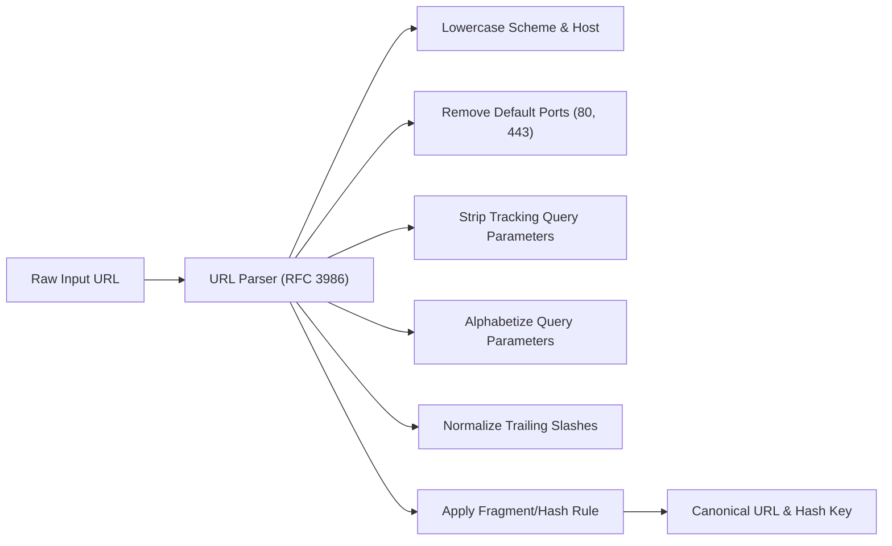

# 05. Unified Results, Canonical URLs & Deduplication

> **Document ID**: SPEC-05  
> **Status**: Normative  
> **Covers Requirements**: #31, #32, #33, #50, #51, #52, #53, #54, #55, #56, #57, #58, #59, #60, #112, #115, #116, #118, #119, #134, #148, #149, #177, #178, #179, #180, #237, #238, #239, #259  

---

## 1. URL Normalization Engine & Canonical Identity

To accurately match tabs, deduplicate results, and detect open destinations, URLs must be normalized into a **Canonical Identity Form**.



### 1.1 Canonical Normalization Rules

1. **Protocol & Host Case**: `HTTPS://GitHub.com/` $\rightarrow$ `https://github.com/`
2. **Default Ports**: `https://example.com:443/` $\rightarrow$ `https://example.com/`
3. **Trailing Slashes**: Standardized to strip trailing slash on root paths or retain consistent path representations.
4. **Alphabetical Query Sorting**: `?b=2&a=1` $\rightarrow$ `?a=1&b=2`
5. **Decoded Safe Characters**: Unescapes unreserved percent-encoded characters (`%7E` $\rightarrow$ `~`).

---

## 2. Tracking Parameter Sanitization

Marketing and telemetry query parameters create artificial URL divergences for identical pages.

### 2.1 Default Global Strip List

The normalization pipeline automatically filters out known non-functional tracking parameters:
- `utm_source`, `utm_medium`, `utm_campaign`, `utm_term`, `utm_content`
- `fbclid`, `gclid`, `gclsrc`, `dclid`, `msclkid`
- `mc_eid`, `_hsenc`, `_hsmi`, `ref_`, `aff_id`

### 2.2 Domain-Specific Query Whitelisting & Preservation

Certain web applications rely critically on query parameters for application state. Navigator maintains domain rules:
- **Jira / Confluence**: Always preserves `selectedIssue`, `rapidView`, `spaceKey`.
- **YouTube**: Always preserves `v` (video ID) and `t` (timestamp); removes `feature`, `si`.
- **GitHub**: Preserves `tab`, `q`, `after`, `before`.

---

## 3. URL Fragment & Hash Handling

User-configurable setting: `settings.hashPolicy` (`'ignore' | 'preserve'`):
- **Ignore (Default for Deduplication)**: `https://github.com/repo#readme` and `https://github.com/repo` are collapsed into the same canonical identity to prevent duplicate open tabs.
- **Preserve (For Deep Navigation)**: Preserved when navigating directly so the browser scrolls to the designated in-page anchor.

---

## 4. Result Type System

```typescript
export type ResultEntityType =
  | 'tab'
  | 'bookmark'
  | 'history'
  | 'pin'
  | 'command'
  | 'calculator'
  | 'remote';

export interface UnifiedResultItem {
  id: string;                      // Deterministic hash based on canonical URL
  canonicalUrl: string;
  displayUrl: string;              // Clean, truncated URL for presentation
  title: string;
  sourceTypes: ResultEntityType[]; // All sources where this resource exists
  primarySource: ResultEntityType; // Highest priority source (e.g. Tab > BM > History)
  
  // Tab Context
  tabContext?: {
    tabId: number;
    windowId: number;
    windowTitle?: string;
    isCurrentWindow: boolean;
    isAudible: boolean;
    isMuted: boolean;
    isPinned: boolean;
    isDiscarded: boolean;
  };

  // Bookmark Context
  bookmarkContext?: {
    bookmarkId: string;
    folderHierarchy: string[];     // ["Engineering", "Frontend"]
  };

  // History Context
  historyContext?: {
    visitCount: number;
    lastVisitTime: number;
  };

  // Ranking & Highlighting
  score: number;
  titleHighlights: [number, number][];
  urlHighlights: [number, number][];
  faviconUrl?: string;
}
```

---

## 5. Cross-Source Entity Deduplication

When a resource exists simultaneously in multiple data sources (e.g. an open tab that is also bookmarked and present in browsing history):
- **Never display multiple duplicate rows**.
- Aggregate the occurrences into a **Single Unified Result Item**.
- The item inherits metadata from all source instances.

```text
Without Deduplication (Poor UX):
[ TAB ]     GitHub — chrome-extension-navigator (github.com/company/repo)
[ BM  ]     GitHub — chrome-extension-navigator (github.com/company/repo)
[ HIST]     GitHub — chrome-extension-navigator (github.com/company/repo)

With Chrome Navigator Unified Deduplication:
[ TAB + BM ]  GitHub — chrome-extension-navigator
              github.com/company/repo       [Window 1]  /Dev/Projects
```

### 5.1 Deduplication Precedence

1. The primary execution target is chosen based on: **Open Tab $\rightarrow$ Pinned Item $\rightarrow$ Bookmark $\rightarrow$ History**.
2. Pressing `Enter` will switch to the existing tab rather than re-navigating.

---

## 6. Result Row Visual Structure

The result list displays rich, scannable rows:

```text
┌────────────────────────────────────────────────────────────────────────┐
│ 🌐  GitHub — my-project                         [TAB]  [BM]  [Window 1] │
│     github.com/company/my-project               /Work/Dev              │
└────────────────────────────────────────────────────────────────────────┘
```

1. **Favicon / Entity Icon**: High-resolution 16x16 icon on the far left.
2. **Title Line**: Main page title with bold highlights on matched character sequences.
3. **URL & Metadata Line**: Cleaned, human-readable URL path in muted typography.
4. **Badges**:
   - **Source Badges**: Visually distinct tags: `[TAB]`, `[BM]`, `[HIST]`, `[PIN]`.
   - **Window Indicator**: `[Current Window]` or `[Window 2]`.
   - **Audio State**: 🔊 `Playing` or 🔇 `Muted`.
   - **Memory State**: 💤 `Sleeping` (Discarded tab).
   - **Bookmark Folder**: Breadcrumb trail displaying folder container.

---

## 7. URL Typography & Smart Domain Names

1. **Smart Domain Normalization**: Strips `http://`, `https://`, and unnecessary `www.` prefixes:
   `https://www.github.com/company/project` $\longrightarrow$ `github.com/company/project`
2. **Domain Contrast**: The domain portion is rendered in high contrast; the pathname and query parameters are displayed in muted secondary color to maximize visual scanning speed.

---

## 8. Substring & Token Match Highlighting

- Matching characters in titles and URLs are wrapped in `<mark>` elements or designated highlight spans (`navigator-match-highlight`).
- Highlights correspond precisely to token positions computed during the matching phase, including disjoint character matches from fuzzy search.

---

## 9. Favicon Resolution & Fallback Protocol

Favicons are loaded via Chrome's secure internal favicon provider:
```
chrome-extension://<EXTENSION_ID>/_favicon/?pageUrl=<ENCODED_URL>&size=32
```
If an icon fails to resolve or is blocked:
- Falls back to an inlined, SVG domain-monogram icon generated dynamically from the hostname's initial letter (e.g. "G" for GitHub).

---

## 10. Fallback Empty State

When a search query yields zero matches:
- Displays a clean, non-intrusive empty state.
- Offers instant fallback actions:
  - `Search Google for "<query>"`
  - `Open URL "https://<query>"`
  - `Search bookmarks only`

---

## 11. Rich Result Preview Panel

Users can enable an optional preview side-panel (`settings.showResultPreview === true`):
- Displays complete URL without truncation.
- Displays full bookmark path hierarchy.
- Displays visit counts and last visit timestamp.
- Lists available context actions (`Ctrl+K`).
