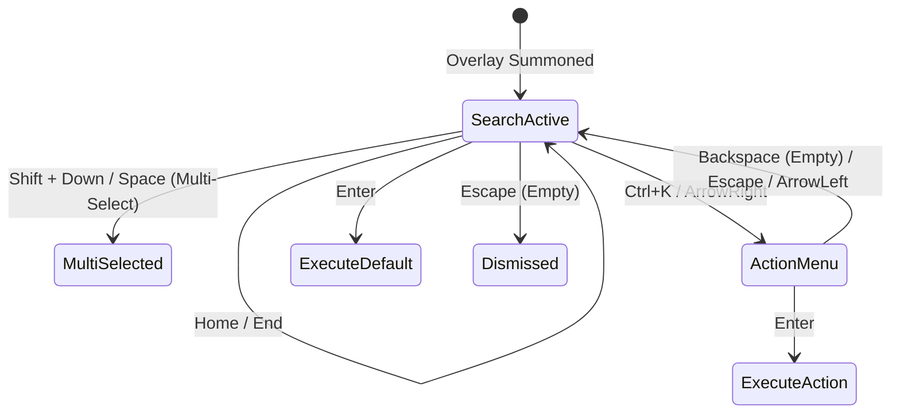

# 06. Keyboard Navigation, Interaction & Action Menu

> **Document ID**: SPEC-06  
> **Status**: Normative  
> **Covers Requirements**: #61, #62, #63, #64, #77, #104, #122, #123, #124, #125, #126, #127, #128, #129, #132, #240, #267, #269, #270, #271, #272, #283, #284  

---

## 1. Primary Keyboard Navigation Controls

Chrome Navigator is strictly keyboard-operable. All interactions are reachable through intuitive, zero-latency keybindings.



### 1.1 Complete Keybinding Reference Table

| Keybinding | Context | Action |
| :--- | :--- | :--- |
| `DownArrow` / `Ctrl+N` | Search / List | Move active selection down |
| `UpArrow` / `Ctrl+P` | Search / List | Move active selection up |
| `Home` / `PageUp` | Search / List | Jump directly to first result |
| `End` / `PageDown` | Search / List | Jump directly to last result |
| `Enter` | Search / List | Navigate / Execute default action for active item |
| `Alt+Enter` | Search / List | Force open in new tab (bypassing tab reuse) |
| `Shift+Enter` | Search / List | Open in background tab |
| `Ctrl+Shift+Enter` | Search / List | Open in new Chrome window |
| `Ctrl+K` / `ArrowRight` | Search / List | Open contextual Actions Menu for active item |
| `Ctrl+C` | Search / List | Copy canonical URL to clipboard |
| `Ctrl+Shift+C` | Search / List | Copy Markdown link `[Title](URL)` |
| `Alt+P` | Search / List | Toggle pin status for active item |
| `Alt+1` ... `Alt+9` | Global Palette | Instantly activate Quick Slot / Pin #1–9 |
| `Shift+Down` / `Tab` | Search / List | Toggle multi-select checkbox for batch actions |
| `Backspace` | Action Menu | Return to primary search palette (if query empty) |
| `Escape` | Palette | 1st press: Clear search text; 2nd press: Dismiss overlay |

---

## 2. Selection Stability Across Asynchronous Updates

A recurring flaw in search palettes is **selection shifting**: as slow asynchronous sources (such as browsing history) finish after fast sources (tabs and bookmarks), inserting new items causes the user's cursor to jump to a different item just as they press `Enter`.

Chrome Navigator implements **Anchor-Based Selection Stability**:
1. When navigating using arrow keys, the palette anchors to the item's **deterministic `id`**, not an array index:
   $$\text{ActiveSelection} = \text{resultItem.id}$$
2. When a new batch of asynchronous results arrives, the list is re-sorted.
3. The engine locates `resultItem.id` in the new array and keeps it focused, automatically adjusting the numeric index.
4. If the active item was pruned due to score changes, selection shifts to the nearest neighbor rather than jumping to index 0.

---

## 3. Cyclic Selection Boundaries (Wrap-Around)

User-configurable via `settings.wrapSelection` (Default: `true`):
- Pressing `DownArrow` on the last item wraps focus to the top item.
- Pressing `UpArrow` on the first item wraps focus to the bottom item.

---

## 4. Clipboard Operations & Multi-Format Exporters

Users can copy page metadata directly without opening the URL:

```typescript
export async function copyItemToClipboard(item: UnifiedResultItem, format: 'url' | 'title' | 'markdown' | 'html'): Promise<void> {
  let content = '';
  switch (format) {
    case 'url':
      content = item.canonicalUrl;
      break;
    case 'title':
      content = item.title;
      break;
    case 'markdown':
      content = `[${item.title}](${item.canonicalUrl})`;
      break;
    case 'html':
      content = `<a href="${item.canonicalUrl}">${item.title}</a>`;
      break;
  }
  await navigator.clipboard.writeText(content);
}
```

---

## 5. Contextual Actions Menu (`Ctrl+K`)

Pressing `Ctrl+K` or `ArrowRight` opens the **Item Action Menu**:

```text
┌────────────────────────────────────────────────────────────────────────┐
│  Search > GitHub — my-project > Actions                                │
├────────────────────────────────────────────────────────────────────────┤
│  ⚡ Open Tab                                                       ↵    │
│  ➕ Open in New Tab                                                ⌥↵   │
│  🕶 Open in Incognito Window                                           │
│  📋 Copy Canonical URL                                            ⌘C   │
│  📝 Copy Markdown Link                                            ⇧⌘C  │
│  ★  Pin Item                                                      ⌥P   │
│  🗑  Close Tab (If open)                                          ⌫    │
│  🕒 Remove from Browsing History                                       │
└────────────────────────────────────────────────────────────────────────┘
```

1. **Sub-Command Searchability**: The Actions Menu is itself searchable; typing filters the available actions.
2. **Discoverability**: Every action row prominently displays its keyboard shortcut badge.
3. **Breadcrumbs**: A visual breadcrumb trail (`Search > Item > Actions`) reinforces user mental context.

---

## 6. Multi-Select & Batch Operations

Users can perform bulk operations across multiple open tabs or history items:
- Pressing `Shift+Down` or `Shift+Up` selects contiguous items.
- Pressing `Space` toggles individual selection checkboxes.
- Once multiple items are selected, pressing `Ctrl+K` exposes **Batch Commands**:
  - `Close Selected Tabs (4)`
  - `Create Tab Group with Selected (4)`
  - `Copy All URLs (4)`
  - `Bookmark Selected Tabs (4)`

---

## 7. Virtualized Scroll Into View

The result list uses a virtualized list container. When the selected item changes via keyboard:
- The element invokes `scrollIntoView({ block: 'nearest', behavior: 'instant' })`.
- Prevents jarring visual jitter or DOM thrashing.

---

## 8. Mouse & Pointer Synchronization

While strictly keyboard-first, full pointer support is maintained:
- **Hover**: Moving the mouse over an item updates the active keyboard selection index.
- **Left Click**: Equivalent to `Enter` (navigates or switches).
- **Middle Click**: Equivalent to `Shift+Enter` (opens in background tab).
- **Right Click**: Opens the `Ctrl+K` Actions Menu.

---

## 9. Quick Slots & Pin Hotkeys (`Alt+1` ... `Alt+9`)

The top 9 pinned items or user-designated quick slots are mapped to numeric hotkeys:
- Pressing `Alt+1` instantly navigates to Pin #1.
- Pressing `Alt+2` navigates to Pin #2.
- Enables instant muscular muscle memory navigation for primary daily tools (e.g. GitHub, Jira, Email).
