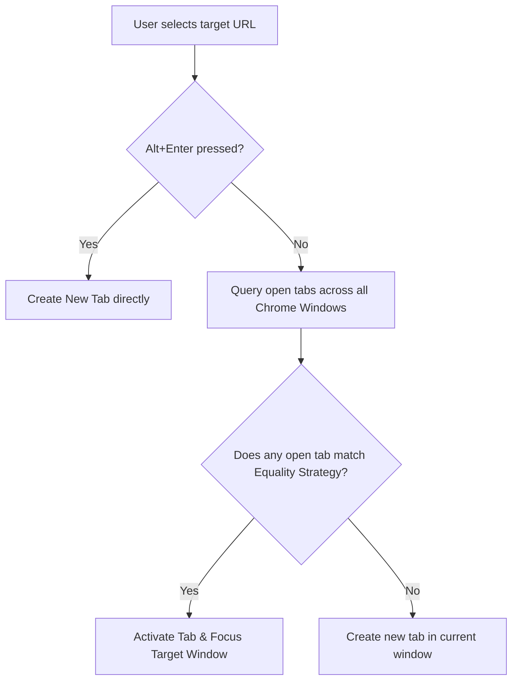
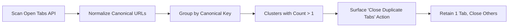

# 07. Navigation Semantics, Tab & Window Management

> **Document ID**: SPEC-07  
> **Status**: Normative  
> **Covers Requirements**: #29, #65, #66, #67, #68, #69, #70, #71, #72, #73, #74, #75, #76, #103, #105, #106, #107, #108, #109, #110, #174, #175, #176, #232, #233, #234  

---

## 1. Primary Navigation Execution Semantics

A central tenet of Chrome Navigator is **intelligent tab reuse over tab proliferation**. When the user triggers navigation (via `Enter` or mouse click):

$$\text{Destination URL} \xrightarrow{\text{Evaluate Strategy}} \begin{cases} \text{Existing Tab Found} & \longrightarrow \text{Focus Window \& Activate Tab} \\ \text{No Match Found} & \longrightarrow \text{Create New Tab} \end{cases}$$



---

## 2. Existing-Tab Detection & Window Switching Protocol

When an existing tab is matched:
1. Identify `tab.windowId` and `tab.id`.
2. If `tab.windowId !== currentWindowId`:
   - Issue `chrome.windows.update(tab.windowId, { focused: true, drawAttention: false })`.
3. Issue `chrome.tabs.update(tab.id, { active: true })`.
4. Dismiss Navigator overlay on origin tab.
5. Total execution time: $< 25\text{ms}$.

---

## 3. Tab Equality & Matching Strategies

Users can configure how aggressively Navigator considers an open tab to be a "duplicate" of the navigation destination:

```typescript
export type TabMatchStrategy =
  | 'exact'         // Exactly identical canonical URL (Default)
  | 'ignore_query'  // Identical path, ignores query string
  | 'same_path'     // Shares root path prefix
  | 'same_origin'   // Shares scheme, host, and port
  | 'same_domain';  // Shares registrable domain (eTLD+1)
```

### 3.1 Comparison of Tab Match Strategies

| Strategy | Destination URL | Existing Open Tab | Match Result |
| :--- | :--- | :--- | :---: |
| **Exact** | `https://jira.com/issue/A?id=1` | `https://jira.com/issue/A?id=1` | **MATCH** |
| **Exact** | `https://jira.com/issue/A?id=1` | `https://jira.com/issue/A?id=2` | **NO MATCH** |
| **Ignore Query** | `https://jira.com/issue/A?id=1` | `https://jira.com/issue/A?id=2` | **MATCH** |
| **Same Path** | `https://github.com/repo/pull/1` | `https://github.com/repo/pull/2` | **MATCH** |
| **Same Origin** | `https://slack.com/client/A` | `https://slack.com/client/B` | **MATCH** |
| **Same Domain** | `https://docs.google.com/doc/1` | `https://sheets.google.com/sheet/2`| **MATCH** |

---

## 4. Modifier Keybindings for Tab Creation

Users can bypass automatic tab reuse using standard keyboard modifiers:

- `Alt + Enter`: **Force New Tab**. Creates a new active tab in the current window, completely ignoring existing open tabs.
- `Shift + Enter`: **Open in Background Tab**. Creates the tab without stealing focus from the current document.
- `Ctrl + Shift + Enter`: **Open in New Window**. Spawns a dedicated new Chrome browser window containing the destination.

---

## 5. Incognito Window Isolation & Boundaries

To protect user privacy and avoid cross-session contamination:
1. **Normal Context**: Search results exclude incognito tabs unless explicitly permitted in extension settings.
2. **Incognito Context**: When Navigator is summoned inside an incognito window:
   - Only incognito tabs are searched by default.
   - History search is completely suppressed to avoid history pollution.
   - Any new tab spawned remains strictly within the incognito window.

---

## 6. Tab Manipulation Actions Catalog

In addition to navigation, Navigator provides in-palette tab control commands:
- **Close Tab (`Delete` / `Backspace`)**: Closes the highlighted open tab.
- **Mute / Unmute Tab**: Toggles audio playback on the target tab (`chrome.tabs.update(tabId, { muted: !isMuted })`).
- **Duplicate Tab**: Clones the selected tab.
- **Pin / Unpin Tab**: Toggles Chrome-native tab pinning.
- **Reload Tab**: Dispatches tab refresh.

---

## 7. Multi-Window Indexing & Scopes

Chrome Navigator indexes open tabs across **all browser windows** simultaneously:
- Result rows indicate origin window (e.g. `[Current Window]` or `[Window 2: Dev]`).
- `/win` or `/window`: Scopes candidate results to a specific window.
- `/current`: Constrains candidate results strictly to the currently focused window.
- `/other`: Constrains results to background/secondary windows.

---

## 8. Chrome Tab Groups Integration

Navigator integrates directly with Chrome's native Tab Groups API (`chrome.tabGroups`):
- **Search by Group**: Typing the name of a tab group (e.g. `/work` or `Sprint 42`) filters tabs belonging to that group.
- **Visual Group Badges**: Displays the group title and color chip on matching tab results.
- **Group Actions**:
  - `Collapse / Expand Group`
  - `Close Entire Group`
  - `Move Tab to Group`
  - `Create New Group from Selected Tabs`

---

## 9. Duplicate Tab Detection & Hygiene Cleanup

Browsing habits frequently result in duplicate open tabs across multiple windows (e.g. 5 open tabs of the same pull request).



### 9.1 `Close Duplicate Tabs` Command

Typing `Close Duplicate Tabs` or invoking it via `/clean`:
1. Scans all open tabs across all windows.
2. Identifies all clusters sharing identical canonical URLs.
3. Keeps the oldest or most recently active tab in each cluster.
4. Closes all redundant duplicate tabs (`chrome.tabs.remove(duplicateIds)`).
5. Displays a notification badge: `"Closed 7 duplicate tabs"`.
