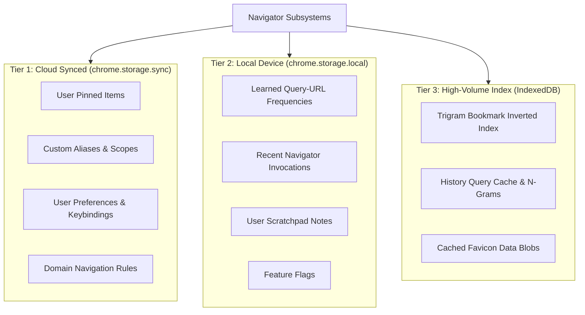

# 10. Persistence, Tiered Storage & Schema Migrations

> **Document ID**: SPEC-10  
> **Status**: Normative  
> **Covers Requirements**: #156, #157, #158, #159, #160, #161, #189, #249, #250, #293, #294, #295, #296  

---

## 1. Tiered Storage Subsystem Architecture

Chrome Navigator enforces a strict three-tier storage model aligned with Chrome Manifest V3 quota constraints and synchronization needs:



### 1.1 Storage Tier Characteristics & Quotas

| Storage Tier | Technology | Quota Limit | Synchronization | Contents |
| :--- | :--- | :---: | :---: | :--- |
| **Tier 1 (Sync)** | `chrome.storage.sync` | 100 KB total / 8 KB per item | Cross-device via Chrome Profile | Pins, Aliases, Settings, Domain Rules |
| **Tier 2 (Local)** | `chrome.storage.local` | 10 MB | Local machine only | Learned frequencies, recents, scratchpad |
| **Tier 3 (Index)** | `IndexedDB` (`navigator_db`)| Unbounded (device disk) | Local machine only | Inverted tri-gram indices, favicon caches |

---

## 2. Cross-Device Synchronization Strategy

- **Selective Syncing**: Only user-authored configurations (pins, aliases, preferences) are synchronized to `chrome.storage.sync`.
- **Local Learning Isolation**: Frequency counters and learned associations are deliberately restricted to `chrome.storage.local` to prevent blowing through Chrome Sync's strict 100KB per-extension quota.

---

## 3. Data Schema Versioning & Automated Migrations

All persistent root stores include a monotonic `schemaVersion` integer. Upon extension initialization or update (`chrome.runtime.onInstalled`), the background worker inspects `schemaVersion` and executes sequential, non-destructive migration scripts.

```typescript
export interface StorageManifest {
  schemaVersion: number;
  lastUpdated: number;
  settings: UserSettings;
  pins: PinnedResource[];
  aliases: CustomAliasDefinition[];
}

export type MigrationFunction = (oldData: any) => Promise<any>;

export const MIGRATIONS: Record<number, MigrationFunction> = {
  1: async (data) => data,
  2: async (data) => {
    // Migration from v1 to v2: Add hashPolicy to settings
    data.settings.hashPolicy = 'ignore';
    data.schemaVersion = 2;
    return data;
  },
  3: async (data) => {
    // Migration from v2 to v3: Normalize all alias triggers
    data.aliases.forEach((a: any) => {
      a.triggers = a.triggers.map((t: string) => t.toLowerCase());
    });
    data.schemaVersion = 3;
    return data;
  }
};
```

### 3.1 Non-Destructive Update Safety

Extension version upgrades must **never erase, reset, or overwrite** user pins, custom aliases, or learned scores. If a migration step encounters an unexpected property, it logs a non-fatal warning and preserves existing fields.

---

## 4. Corrupt Store Fallback & Error Recovery

If `chrome.storage` returns malformed JSON or corrupted schemas:
1. Navigator creates an automated rescue backup: `navigator_corrupt_backup_<timestamp>`.
2. Replaces damaged fields with valid default configuration structures.
3. Notifies the user via a status banner: `"Settings repaired to safe defaults (backup saved)"`.
4. The core command palette opens normally without throwing unhandled exceptions.

---

## 5. JSON Schema Export & Import Engine

Users can export and import their complete configuration as a validated JSON document:

```typescript
export interface ExportPackage {
  app: 'ChromeNavigator';
  exportVersion: number;
  exportedAt: string; // ISO 8601
  payload: {
    settings: UserSettings;
    pins: PinnedResource[];
    aliases: CustomAliasDefinition[];
    domainRules: DomainRuleDefinition[];
  };
}
```

- **Schema Validation**: On import, payload is validated against a strict JSON schema before committing to storage.
- **Conflict Strategy**: User can choose between `Merge (Keep Existing)` or `Overwrite Entire Configuration`.

---

## 6. Backup Archiving & Factory Reset

- **Create Backup**: Generates an immediate snapshot stored in `IndexedDB`.
- **Factory Reset**:
  - `Reset Settings Only`: Restores appearance, keybindings, and search weights to defaults.
  - `Reset Learned Data`: Wipes local frequency and query association models.
  - `Full Reset`: Purges all pins, aliases, history indices, and restored defaults.
