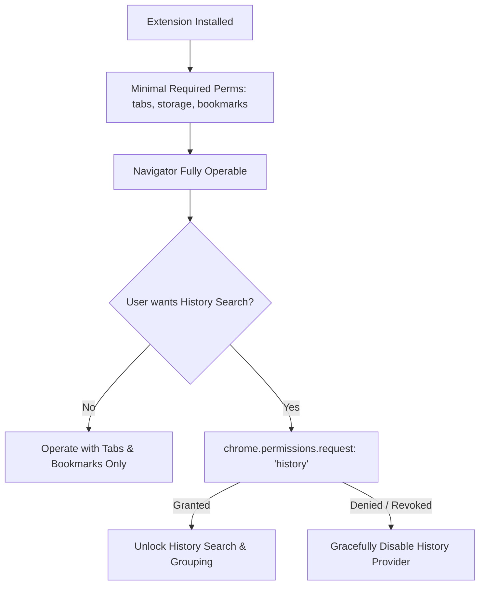

# 11. Privacy Guarantees, Security Boundaries & Permissions

> **Document ID**: SPEC-11  
> **Status**: Normative  
> **Covers Requirements**: #135, #152, #153, #154, #155, #192, #193, #208, #209, #210, #211, #262, #287, #297, #298, #299  

---

## 1. Local-First Privacy Directives & Zero External Telemetry

Chrome Navigator operates under an uncompromising **Zero-Telemetry Privacy Guarantee**:

1. **Zero External Network Requests**: The core extension makes **zero HTTP/HTTPS requests** to remote servers, analytics endpoints, or external APIs during search, matching, navigation, or ranking.
2. **Zero Telemetry Tracking**: No analytics libraries (Google Analytics, Mixpanel, Sentry, Segment) are embedded or loaded.
3. **Local-Only Autocomplete**: All query autocompletions and suggestions are generated strictly from local on-device caches.
4. **No Keylogging**: In-page keystrokes are evaluated solely within isolated script memory and discarded immediately upon overlay dismissal.

---

## 2. History Privacy & Excluded Domain Scrubbing

Users can designate sensitive domains to be permanently excluded from Navigator indexing and ranking:

```typescript
export interface PrivacyConfig {
  excludedDomains: string[];      // ["bank.com", "healthportal.org", "internal.net"]
  disableHistorySearch: boolean;  // Entirely disable chrome.history access
  enablePrivateMode: boolean;     // Disables local query-frequency logging
}
```

- When indexing or searching history, any URL whose hostname matches an entry in `excludedDomains` is **filtered out before scoring or display**.

---

## 3. Ephemeral Private Search Mode

Users can summon Navigator in **Private Search Mode** (or toggle it via `/private`):
- Searches tabs and bookmarks normally.
- Completely disables all navigation logging, frequency counting, and query-URL association updates for the duration of the session.
- No trace of searches conducted in Private Mode is saved to `chrome.storage.local`.

---

## 4. Progressive Permission Lifecycle & Optional History

Chrome Navigator adheres to the **Principle of Least Privilege**:



### 4.1 Minimal Base Permissions in `manifest.json`

- `"permissions": ["tabs", "storage", "bookmarks", "commands"]`
- `"optional_permissions": ["history", "tabGroups"]`

### 4.2 Graceful Permission Revocation

If the user revokes `history` permission in Chrome settings:
- The background worker catches `chrome.permissions.onRemoved`.
- Replaces history search with a non-blocking UI notice: `"History search disabled (Enable in settings)"`.
- Core tab and bookmark search continue functioning without runtime exceptions.

---

## 5. URL Safety, Protocol Whitelist & Execution Defense

To prevent Cross-Site Scripting (XSS) and arbitrary code execution vulnerabilities:

### 5.1 Protocol Whitelist

The navigation dispatcher validates destination URLs against a strict protocol whitelist before passing them to `chrome.tabs.create()` or `chrome.tabs.update()`:

```typescript
const ALLOWED_PROTOCOLS = new Set(['http:', 'https:', 'file:', 'chrome-extension:']);

export function validateSafeUrl(rawUrl: string): boolean {
  try {
    const parsed = new URL(rawUrl);
    if (!ALLOWED_PROTOCOLS.has(parsed.protocol)) {
      console.error(`Blocked unsafe protocol: ${parsed.protocol}`);
      return false;
    }
    return true;
  } catch {
    return false;
  }
}
```

### 5.2 Strict Rejection of Dangerous Protocols

- **Absolute Prohibition of `javascript:`**: Any attempt to navigate to a `javascript:` pseudo-protocol URL is rejected and logged as a security event.
- **Prohibition of Arbitrary `data:` URIs**: Prevents navigation to embedded HTML/SVG scripts.

---

## 6. Alias Validation & Conflict Defense

1. **Domain Syntax Validation**: Custom alias definitions are validated against valid RFC 1123 hostname formats before saving.
2. **Duplicate Alias Detection**: When saving an alias, the settings validator detects duplicate triggers across custom aliases and displays a prominent warning.
3. **Dangerous Keybinding Collisions**: The UI prevents binding overlapping single-stroke shortcuts that would break standard command palette navigation.
