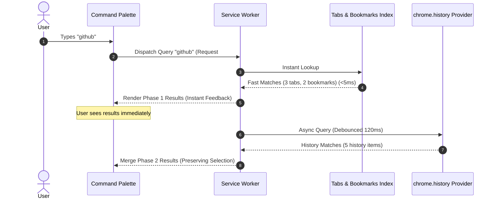

# 13. Performance, High-Volume Scalability & Concurrency

> **Document ID**: SPEC-13  
> **Status**: Normative  
> **Covers Requirements**: #130, #131, #133, #136, #181, #182, #183, #184, #185, #186, #187, #188, #191, #246  

---

## 1. Latency Budgets & Service Level Objectives (SLO)

To maintain a fluid, keyboard-first desktop experience, Chrome Navigator enforces strict latency ceilings:

| Milestone Metric | Maximum Budget | Target Objective | Strategy |
| :--- | :---: | :---: | :--- |
| **Summon to Interactive (TTI)** | $50\text{ms}$ | $< 25\text{ms}$ | Pre-cached DOM template in content script |
| **Keystroke Response (Input)** | $16\text{ms}$ | $< 8\text{ms}$ | Synchronous virtual DOM diffing (60 FPS) |
| **Instant Source Match (Tabs/BM)** | $15\text{ms}$ | $< 5\text{ms}$ | In-memory tri-gram index lookup |
| **Full Async Result Complete** | $150\text{ms}$ | $< 80\text{ms}$ | Debounced async history retrieval |
| **Tab Switch / Navigation Execution**| $35\text{ms}$ | $< 20\text{ms}$ | Direct `chrome.tabs.update` call |

---

## 2. High-Volume Scalability Benchmarks

Navigator is engineered and benchmarked against extreme power-user browsing profiles:

```text
┌─────────────────────────────────────────────────────────────┐
│ High-Volume Stress Benchmark Targets                        │
├─────────────────────────────────────────────────────────────┤
│ Open Chrome Tabs:          500+ tabs across 8 windows       │
│ Chrome Bookmarks:          10,000+ items across 300 folders │
│ Browsing History:          50,000+ URL visit records        │
│ Custom User Aliases:       200+ aliases                     │
│ Target Heap Footprint:     < 35 MB background memory        │
└─────────────────────────────────────────────────────────────┘
```

### 2.1 Benchmark Optimizations

1. **Tabs Collection**: Tabs are indexed in an in-memory hash map updated reactively via Chrome Tab events (`onCreated`, `onRemoved`, `onUpdated`), eliminating expensive bulk polling on every keystroke.
2. **Bookmark Tree**: Indexed using tri-grams in an off-thread Web Worker or IndexedDB cursor, avoiding UI thread freezing.
3. **History Traversal**: History is never bulk-loaded. Queries pass targeted sub-clauses to `chrome.history.search({ text, maxResults: 100 })`.

---

## 3. Tiered Asynchronous Result Streaming

Search results stream progressively in two discrete phases to balance speed and completeness:



---

## 4. Search Cancellation & Stale Result Rejection

When typing rapidly (e.g. `g` $\rightarrow$ `gi` $\rightarrow$ `git` $\rightarrow$ `gith` $\rightarrow$ `github`):
1. Older asynchronous search promises for `git` may finish **after** the search for `github` has already completed.
2. Every request is tagged with an incrementing integer `monotonicRequestId`.
3. If an async response arrives with `requestId < currentRequestId`, the background worker and UI drop it immediately.
4. Active fetch/history searches are aborted using `AbortController.abort()`.

---

## 5. Keystroke Debounce Architecture

- **Tabs & Bookmarks**: **0ms debounce**. Evaluation begins immediately on the keypress event loop tick.
- **Browsing History**: **120ms debounce**. If another key is pressed within 120ms, the previous history query is cancelled before executing against SQLite/Chrome internal disk history.

---

## 6. Race Conditions & Transient Browser Events

Between the moment a result row is rendered and the moment the user strikes `Enter`, external browser state can change:
- **Tab Closed**: If the destination tab was closed by another process, Navigator catches the error and seamlessly falls back to creating a new tab with the target URL.
- **Window Closed**: If the target window was closed, focus falls back to the active window.
- **Bookmark Deleted**: Treated as standard navigation to the underlying URL.

---

## 7. Fault Tolerance & Degraded Operating Modes

If any single data provider encounters an unhandled exception or API failure (e.g. `chrome.history` API restricted by enterprise policy):
- The failure is isolated to that specific source provider.
- Tabs and Bookmarks continue delivering full functionality.
- Displays a subtle badge in the footer: `⚠️ History unavailable`.
- Never crashes the palette.
