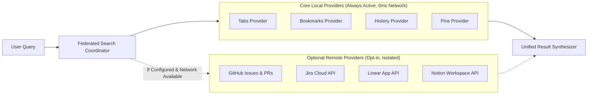

# 14. Integrations, Remote Providers & Extensibility Architecture

> **Document ID**: SPEC-14  
> **Status**: Informative / Extension Standard  
> **Covers Requirements**: #288, #289, #290, #291, #292  

---

## 1. Remote Integration Architecture

While the primary identity of Chrome Navigator is finding and navigating resources **already inside the browser**, its architecture includes an extensible provider model designed to support optional external service integrations:



### 1.1 Non-Interference Design Rules

1. **Local-First Precedence**: Core browser tabs and bookmarks are always queried first and returned with zero latency.
2. **Strict Fault Isolation**: Remote provider timeouts or network disconnections (e.g. offline flight) never block, slow down, or fail local browser search results.
3. **Opt-In Security Model**: Remote integrations require explicit user authentication and API keys stored securely in local extension storage.

---

## 2. Remote Resource Entity Contract (`RemoteResource`)

```typescript
export interface RemoteResource {
  id: string;                      // e.g. "github:pull:company/repo#42"
  provider: 'github' | 'jira' | 'linear' | 'notion' | 'custom';
  title: string;                   // "feat: Add fuzzy matching pipeline"
  canonicalUrl: string;            // "https://github.com/company/repo/pull/42"
  subtitle: string;                // "Open #42 by @developer"
  statusBadge?: {
    text: string;                  // "OPEN" | "MERGED" | "IN PROGRESS"
    color: string;
  };
  updatedAt: number;
}
```

---

## 3. Parametric Remote Scopes

Users can invoke remote search providers explicitly using scoped commands:
- `/gh <repo> <query>`: Queries GitHub repository issues and pull requests via GitHub REST/GraphQL API.
- `/jira <query>`: Queries Jira Cloud issues via JQL.
- `/linear <query>`: Searches Linear workspace issues.

---

## 4. Standard Provider Extension Interface

To enable future community-authored plugins and integrations without modifying the core codebase:

```typescript
export interface SearchProvider {
  id: string;
  name: string;
  isLocal: boolean;                // true for zero-network providers
  scopes?: string[];               // e.g. ["gh", "github"]
  search(query: string, signal: AbortSignal): Promise<UnifiedResultItem[]>;
}

export interface ActionProvider {
  id: string;
  name: string;
  appliesTo(item: UnifiedResultItem): boolean;
  execute(item: UnifiedResultItem): Promise<void>;
}
```

---

## 5. Offline Behavior & Network Independence

When network connectivity is unavailable (`navigator.onLine === false`):
- Remote providers are bypassed instantly.
- Local searching over tabs, bookmarks, history, pins, and custom aliases operates without performance impact or warning alerts.
