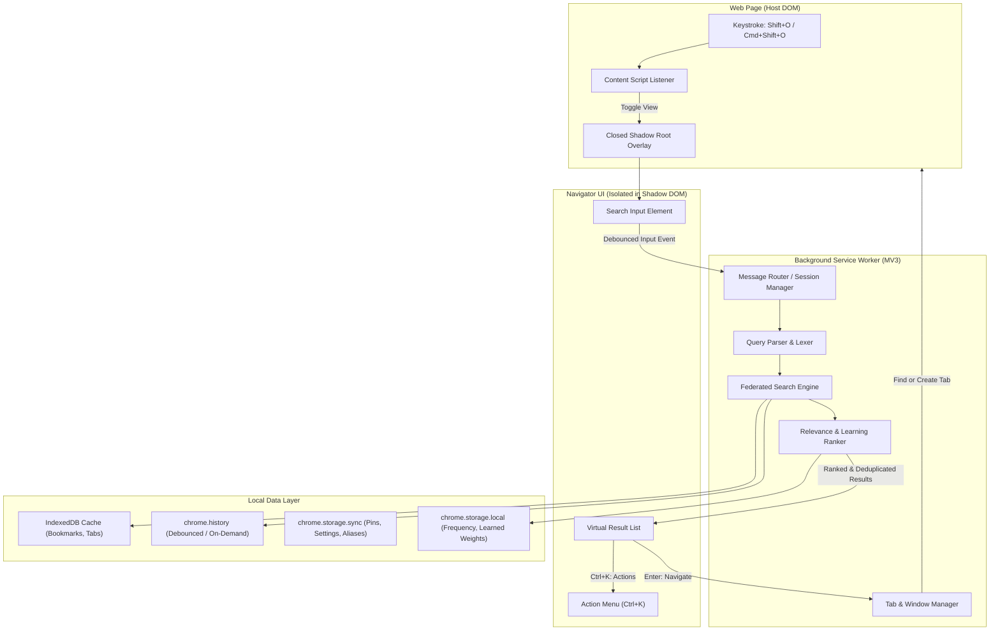

# Chrome Navigator — Technical Specification Suite

> **Version**: 1.0.0-draft  
> **Target Platform**: Google Chrome / Chromium-based Browsers (Manifest V3)  
> **Status**: Living Standard / Normative Specification  
> **License**: Apache 2.0 / MIT Dual License  

---

## Executive Summary

**Chrome Navigator** is a fast, keyboard-first universal command palette and navigator for Google Chrome. Modern browsing is inherently fragmented across hundreds of open tabs, thousands of bookmarks, vast browsing histories, and diverse web application domains. Chrome Navigator unifies these disparate browser resources into a single, cohesive, local-first search and navigation interface:

$$\text{Open} \xrightarrow{\text{Instant}} \text{Type} \xrightarrow{\text{Smart Match}} \text{Navigate}$$

This technical specification suite formalizes all functional requirements, architectural boundaries, data models, algorithms, keyboard interaction patterns, privacy guarantees, and lifecycle models originally codified in the product specification.

---

## Specification Directory & Document Map

The specification suite is organized into 15 domain-specific documents:

```
docs/specs/
├── README.md                               # Master Index & Requirement Traceability Matrix
├── 00-overview-and-architecture.md         # Product Vision, Extension Anatomy & Lifecycles
├── 01-invocation-and-overlay.md            # Shortcuts, Shadow DOM Overlay, CSS & Web Isolation
├── 02-query-syntax-and-parser.md           # Lexer, EBNF Grammar, Scopes, Modifiers & Aliases
├── 03-search-engine-and-matching.md        # Matching Pipeline (Fuzzy, Token, Prefix, Acronym)
├── 04-ranking-and-relevance.md             # Scoring Math, Boosts, Local Learning & Decay
├── 05-unified-results-and-deduplication.md # Canonical URLs, Deduplication & Result UI Layout
├── 06-keyboard-and-user-interaction.md     # Focus Model, Selection Stability, Actions Menu & Copy
├── 07-navigation-and-tab-management.md     # Existing-Tab Detection, Window Switching & Tab Ops
├── 08-pins-favorites-and-context.md        # Pin Subsystem, Empty State, Tags & Workspaces
├── 09-commands-tools-and-integrations.md   # Browser Commands, URL Launcher, Calculator & Omnibox
├── 10-storage-sync-and-migrations.md       # Storage Tiering, Schema Versioning & Backups
├── 11-privacy-security-and-safety.md       # Zero-Telemetry, Protocol Whitelists & Permissions
├── 12-configuration-and-appearance.md      # Settings Schema, Theming, Density & Custom Rules
├── 13-performance-and-scalability.md       # Latency Budgets, Cancellation & Scale Benchmarks
└── 14-integrations-and-extensibility.md    # Remote Provider Model, Plugins & Extensibility
```

### High-Level Document Directory

| Document | Primary Domain | Key Specifications |
| :--- | :--- | :--- |
| **[00. Overview & Architecture](00-overview-and-architecture.md)** | System Design | MV3 anatomy, service worker lifecycle, session boundaries, offline guarantees. |
| **[01. Invocation & Overlay](01-invocation-and-overlay.md)** | UI & DOM Isolation | `Shift+O`, Shadow DOM encapsulation, z-index strategy, rich-editor compatibility. |
| **[02. Query Syntax & Parser](02-query-syntax-and-parser.md)** | Parsing & Semantics | EBNF grammar, `/tab`, `/bm`, `/history`, `@query`, `@domain`, custom aliases. |
| **[03. Search Engine & Matching](03-search-engine-and-matching.md)** | Information Retrieval | Exact, prefix, substring, token, fuzzy, acronyms, unicode normalization. |
| **[04. Ranking & Relevance](04-ranking-and-relevance.md)** | Scoring & ML | Scoring algorithm, source weighting, recency decay, local learned ranking. |
| **[05. Unified Results & Deduplication](05-unified-results-and-deduplication.md)** | Data Normalization | Canonical URLs, tracking parameter stripping, unified result badges. |
| **[06. Keyboard & Interaction](06-keyboard-and-user-interaction.md)** | UX & Interactions | Arrow navigation, selection wrap, `Ctrl+K` action menu, clipboard formatting. |
| **[07. Navigation & Tab Management](07-navigation-and-tab-management.md)** | Browser Automation | Tab reuse strategies, multi-window switching, duplicate tab detection. |
| **[08. Pins, Favorites & Context](08-pins-favorites-and-context.md)** | Persistence & Access | Pin semantics (URL, Domain, Search, Command), empty state view, workspaces. |
| **[09. Commands, Tools & Utilities](09-commands-tools-and-integrations.md)** | Productivity Tools | Omnibox integration, quick calculator, URL launcher, search templates. |
| **[10. Storage, Sync & Migrations](10-storage-sync-and-migrations.md)** | Data Layer | IndexedDB, Chrome storage sync, schema migrations, backup/restore. |
| **[11. Privacy, Security & Safety](11-privacy-security-and-safety.md)** | Security Architecture | Zero telemetry, protocol restrictions, dynamic permission onboarding. |
| **[12. Configuration & Appearance](12-configuration-and-appearance.md)** | Settings & Styling | Density modes, dark/light themes, custom domain rules, feature flags. |
| **[13. Performance & Scalability](13-performance-and-scalability.md)** | Optimization & Scale | 16ms frame budget, 10k+ bookmarks scale, cancellation tokens, debouncing. |
| **[14. Integrations & Extensibility](14-integrations-and-extensibility.md)** | Extensibility | Remote resource providers (Jira, GitHub, Linear), plugin architecture. |

---

## Architectural Flow Overview



---

## Master Requirement Traceability Matrix (Sections 1 – 300)

Every requirement specified in the original specification document (`docs/SPECS.md`) maps deterministically to its formal section in this specification suite:

| Original Item # | Original Title | Formal Specification Document | Target Section |
| :---: | :--- | :--- | :--- |
| **1** | Product Overview | `00-overview-and-architecture.md` | § 1. Product Vision & Mission |
| **2** | Core Product Concept | `00-overview-and-architecture.md` | § 2. Core Concepts & Operating Model |
| **3** | Primary User Goals | `00-overview-and-architecture.md` | § 3. User Experience Goals |
| **4** | Invocation | `01-invocation-and-overlay.md` | § 1. Primary Shortcut & Keystroke Filtering |
| **5** | Browser Shortcut | `01-invocation-and-overlay.md` | § 2. Browser-Level Global Shortcuts |
| **6** | Toggle Behavior | `01-invocation-and-overlay.md` | § 3. Toggle Lifecycle & State Transitions |
| **7** | Overlay Behavior | `01-invocation-and-overlay.md` | § 4. Overlay Injection & DOM Encapsulation |
| **8** | Overlay Position | `01-invocation-and-overlay.md` | § 5. Positioning, Geometry & Centering |
| **9** | Overlay Dismiss | `01-invocation-and-overlay.md` | § 6. Dismissal Triggers & Blur Semantics |
| **10** | Search Input | `01-invocation-and-overlay.md` | § 7. Search Input Mechanics & Autofocus |
| **11** | Universal Search | `03-search-engine-and-matching.md` | § 1. Universal Search Architecture |
| **12** | Searchable Fields | `03-search-engine-and-matching.md` | § 2. Searchable Attribute Schema |
| **13** | Default Source Priority | `04-ranking-and-relevance.md` | § 2. Source Weighting Hierarchy |
| **14** | Search Scope Commands | `02-query-syntax-and-parser.md` | § 3. Built-in Scope Commands (`/tab`, etc.) |
| **15** | Search Scope Combination | `02-query-syntax-and-parser.md` | § 4. Modifier & Scope Composition |
| **16** | Custom Domain Scope | `02-query-syntax-and-parser.md` | § 5. Custom Domain Aliases |
| **17** | Multiple Domains Per Scope | `02-query-syntax-and-parser.md` | § 5. Multi-Domain Mapping |
| **18** | Custom Prefix | `02-query-syntax-and-parser.md` | § 6. Custom Trigger Prefixes |
| **19** | Prefix Case Sensitivity | `02-query-syntax-and-parser.md` | § 6. Prefix Matching Rules |
| **20** | Prefix Position | `02-query-syntax-and-parser.md` | § 6. Prefix Head-Position Anchoring |
| **21** | Alias Conflict | `02-query-syntax-and-parser.md` | § 7. Conflict Resolution & Precedence |
| **22** | Alias Priority | `02-query-syntax-and-parser.md` | § 7. Longest Match Precedence |
| **23** | Custom Alias Model | `02-query-syntax-and-parser.md` | § 8. Alias Configuration Model |
| **24** | Domain Matching | `03-search-engine-and-matching.md` | § 8. Hostname & Domain Matching Rules |
| **25** | URL Pattern Matching | `03-search-engine-and-matching.md` | § 9. Path & Wildcard Pattern Matching |
| **26** | Search Modifiers | `02-query-syntax-and-parser.md` | § 9. Search Modifiers Specification |
| **27** | @query | `02-query-syntax-and-parser.md` | § 9. `@query` Deep Link Preservation |
| **28** | @domain | `02-query-syntax-and-parser.md` | § 9. `@domain` Root Truncation |
| **29** | Default Navigation Preference | `07-navigation-and-tab-management.md` | § 2. Navigation Mode Hierarchy |
| **30** | Alias-Level Navigation Preference | `02-query-syntax-and-parser.md` | § 8. Alias Navigation Overrides |
| **31** | URL Normalization | `05-unified-results-and-deduplication.md` | § 1. URL Normalization Engine |
| **32** | Tracking Parameter Handling | `05-unified-results-and-deduplication.md` | § 2. Tracking Parameter Sanitization |
| **33** | Hash Handling | `05-unified-results-and-deduplication.md` | § 3. URL Fragment & Hash Policies |
| **34** | Exact Search | `03-search-engine-and-matching.md` | § 3. Exact Matching Tier |
| **35** | Prefix Search | `03-search-engine-and-matching.md` | § 4. Prefix Matching Tier |
| **36** | Contains Search | `03-search-engine-and-matching.md` | § 5. Substring Matching Tier |
| **37** | Token Search | `03-search-engine-and-matching.md` | § 6. Unordered Token Matching Tier |
| **38** | Fuzzy Search | `03-search-engine-and-matching.md` | § 7. Fuzzy Matching Tier |
| **39** | Fuzzy Search Strength | `03-search-engine-and-matching.md` | § 7. Configurable Fuzzy Strength |
| **40** | Typo Tolerance | `03-search-engine-and-matching.md` | § 7. Levenshtein / Damerau Distance |
| **41** | Search Ranking | `04-ranking-and-relevance.md` | § 1. Multi-Factor Scoring Formula |
| **42** | Source Score | `04-ranking-and-relevance.md` | § 2. Source Base Scores |
| **43** | Current Window Boost | `04-ranking-and-relevance.md` | § 3. Window Locality Multiplier |
| **44** | Active Tab Penalty | `04-ranking-and-relevance.md` | § 4. Active Tab Suppression Policy |
| **45** | Recent Boost | `04-ranking-and-relevance.md` | § 5. Recency Boost & Decay Function |
| **46** | Frequency Boost | `04-ranking-and-relevance.md` | § 6. Access Frequency Multiplier |
| **47** | Learned Ranking | `04-ranking-and-relevance.md` | § 7. Local Frequency-Based Feedback |
| **48** | Query-Specific Learning | `04-ranking-and-relevance.md` | § 7. Query-to-Target Association |
| **49** | Decay | `04-ranking-and-relevance.md` | § 8. Exponential Decay Mathematical Model |
| **50** | Search Result Types | `05-unified-results-and-deduplication.md` | § 4. Result Type System |
| **51** | Unified Result | `05-unified-results-and-deduplication.md` | § 5. Cross-Source Entity Aggregation |
| **52** | Result Deduplication | `05-unified-results-and-deduplication.md` | § 6. Deduplication Pipeline |
| **53** | Deduplication Strategy | `05-unified-results-and-deduplication.md` | § 6. Deduplication Priority Criteria |
| **54** | Result Row | `05-unified-results-and-deduplication.md` | § 7. Row Visual Structure |
| **55** | URL Display | `05-unified-results-and-deduplication.md` | § 8. URL Typography & Truncation |
| **56** | Match Highlight | `05-unified-results-and-deduplication.md` | § 9. Substring & Token Highlighting |
| **57** | Result Source Badge | `05-unified-results-and-deduplication.md` | § 10. Source Badge Visual Indicators |
| **58** | Open Tab Indicator | `05-unified-results-and-deduplication.md` | § 11. Tab Status Indicators |
| **59** | Current Window Indicator | `05-unified-results-and-deduplication.md` | § 11. Window Indicator Badges |
| **60** | Window Information | `05-unified-results-and-deduplication.md` | § 11. Window Title & Number Details |
| **61** | Keyboard Navigation | `06-keyboard-and-user-interaction.md` | § 1. Primary Navigation Controls |
| **62** | Keyboard Focus Model | `06-keyboard-and-user-interaction.md` | § 2. Active Index & Focus State |
| **63** | Selection Wrap | `06-keyboard-and-user-interaction.md` | § 3. Cyclic Selection Boundaries |
| **64** | Home / End | `06-keyboard-and-user-interaction.md` | § 4. Boundary Navigation Keys |
| **65** | Open Behavior | `07-navigation-and-tab-management.md` | § 1. Primary Navigation Semantics |
| **66** | Existing Tab Detection | `07-navigation-and-tab-management.md` | § 3. Tab Reuse & Switching Protocol |
| **67** | Existing Tab Match Strategies | `07-navigation-and-tab-management.md` | § 4. Tab Equality Strategies |
| **68** | Exact Match | `07-navigation-and-tab-management.md` | § 4. Canonical Exact Match |
| **69** | Ignore Query | `07-navigation-and-tab-management.md` | § 4. Path-Level Identity |
| **70** | Same Path | `07-navigation-and-tab-management.md` | § 4. Pathname Prefix Match |
| **71** | Same Origin | `07-navigation-and-tab-management.md` | § 4. Origin Reuse Mode |
| **72** | Same Domain | `07-navigation-and-tab-management.md` | § 4. Registrable Domain Reuse |
| **73** | Force New Tab | `07-navigation-and-tab-management.md` | § 5. Modifier Shortcuts (`Alt+Enter`) |
| **74** | Background Tab | `07-navigation-and-tab-management.md` | § 5. Background Opening (`Shift+Enter`) |
| **75** | Open New Window | `07-navigation-and-tab-management.md` | § 5. Window Spawning (`Ctrl+Shift+Enter`) |
| **76** | Incognito | `07-navigation-and-tab-management.md` | § 6. Incognito Window Isolation |
| **77** | Result Click | `06-keyboard-and-user-interaction.md` | § 8. Mouse & Pointer Interactions |
| **78** | Pin Feature | `08-pins-favorites-and-context.md` | § 1. Pinning Mechanics (`Alt+P`) |
| **79** | Pin Semantics | `08-pins-favorites-and-context.md` | § 2. Polymorphic Pin Types |
| **80** | URL Pin | `08-pins-favorites-and-context.md` | § 2. Direct URL Pinning |
| **81** | Domain Pin | `08-pins-favorites-and-context.md` | § 2. Root Domain Pinning |
| **82** | Search Pin | `08-pins-favorites-and-context.md` | § 2. Saved Query / Search Pinning |
| **83** | Command Pin | `08-pins-favorites-and-context.md` | § 2. Quick Command Pinning |
| **84** | Empty Query | `08-pins-favorites-and-context.md` | § 4. Default Empty View Composition |
| **85** | Pinned Section | `08-pins-favorites-and-context.md` | § 4. Pinned Section Layout |
| **86** | Recent Section | `08-pins-favorites-and-context.md` | § 4. Session Recency Section |
| **87** | Recently Closed | `08-pins-favorites-and-context.md` | § 4. Closed Tabs Recovery Section |
| **88** | Frequent Section | `08-pins-favorites-and-context.md` | § 4. Top Frequent Destinations |
| **89** | Current Context | `04-ranking-and-relevance.md` | § 3. Current Domain Contextual Boost |
| **90** | Search History | `09-commands-tools-and-integrations.md` | § 1. Navigator Query History |
| **91** | Search History Controls | `09-commands-tools-and-integrations.md` | § 1. History Retention & Clearing |
| **92** | Saved Search | `08-pins-favorites-and-context.md` | § 5. Saved Searches Schema |
| **93** | Saved Search Invocation | `08-pins-favorites-and-context.md` | § 5. Saved Search Re-Execution |
| **94** | Search Engine Fallback | `09-commands-tools-and-integrations.md` | § 2. Web Search Engine Fallback |
| **95** | Custom Search Engines | `09-commands-tools-and-integrations.md` | § 3. Custom Search Engine Definitions |
| **96** | Search Engine Prefixes | `09-commands-tools-and-integrations.md` | § 3. Search Engine Trigger Prefixes |
| **97** | URL Templates | `09-commands-tools-and-integrations.md` | § 4. Parametric URL Interpolation |
| **98** | GitHub URL Template | `09-commands-tools-and-integrations.md` | § 4. Standard GitHub Templates |
| **99** | Search URL Template | `09-commands-tools-and-integrations.md` | § 4. Generic Engine URL Formats |
| **100** | Alias Action Types | `09-commands-tools-and-integrations.md` | § 5. Action Handlers & Types |
| **101** | Commands Mode | `09-commands-tools-and-integrations.md` | § 6. Browser Command Palette (`>`) |
| **102** | Browser Commands | `09-commands-tools-and-integrations.md` | § 7. Standard Browser Action Catalog |
| **103** | Tab Management | `07-navigation-and-tab-management.md` | § 7. Tab Manipulation Actions |
| **104** | Multi-Select | `06-keyboard-and-user-interaction.md` | § 6. Multi-Item Selection & Batching |
| **105** | Window Search | `07-navigation-and-tab-management.md` | § 8. Multi-Window Tab Indexing |
| **106** | Window Filter | `07-navigation-and-tab-management.md` | § 8. Scoped Window Filter (`/win`) |
| **107** | Current Window Scope | `07-navigation-and-tab-management.md` | § 8. Active Window Constriction |
| **108** | Other Window Scope | `07-navigation-and-tab-management.md` | § 8. Background Window Filter |
| **109** | Tab Groups | `07-navigation-and-tab-management.md` | § 9. Tab Group Search & Indexing |
| **110** | Tab Group Actions | `07-navigation-and-tab-management.md` | § 9. Tab Group Command Suite |
| **111** | Bookmark Search | `03-search-engine-and-matching.md` | § 10. Bookmark Hierarchy Search |
| **112** | Bookmark Folder Display | `05-unified-results-and-deduplication.md` | § 12. Bookmark Breadcrumb Metadata |
| **113** | Bookmark Actions | `09-commands-tools-and-integrations.md` | § 8. Bookmark Manipulation Commands |
| **114** | History Search | `03-search-engine-and-matching.md` | § 11. Full Browser History Retrieval |
| **115** | History Grouping | `05-unified-results-and-deduplication.md` | § 13. Temporal & Domain History Groups |
| **116** | Smart History Grouping | `05-unified-results-and-deduplication.md` | § 13. Semantic History Aggregation |
| **117** | History Actions | `09-commands-tools-and-integrations.md` | § 9. History Purge & Copy Actions |
| **118** | Query Parameter Rules | `05-unified-results-and-deduplication.md` | § 2. Global Parameter Normalization |
| **119** | Domain-Specific Query Rules | `05-unified-results-and-deduplication.md` | § 2. Per-Domain Param Whitelists |
| **120** | Domain Navigation Rules | `12-configuration-and-appearance.md` | § 4. Domain Navigation Defaults |
| **121** | Custom URL Rules | `12-configuration-and-appearance.md` | § 5. Custom URL Rewrite Pipelines |
| **122** | Copy URL | `06-keyboard-and-user-interaction.md` | § 5. Clipboard Shortcuts (`Ctrl+C`) |
| **123** | Copy Title | `06-keyboard-and-user-interaction.md` | § 5. Title Copy Action |
| **124** | Copy Markdown | `06-keyboard-and-user-interaction.md` | § 5. Markdown Anchor Generation |
| **125** | Copy Formats | `06-keyboard-and-user-interaction.md` | § 5. Multi-Format Clipboard Export |
| **126** | Actions Menu | `06-keyboard-and-user-interaction.md` | § 7. Context Action Menu (`Ctrl+K`) |
| **127** | Action Search | `06-keyboard-and-user-interaction.md` | § 7. Sub-Command Searchability |
| **128** | Mouse Support | `06-keyboard-and-user-interaction.md` | § 8. Pointer Event Synchronization |
| **129** | Scroll Behavior | `06-keyboard-and-user-interaction.md` | § 9. Virtualized Scroll Into View |
| **130** | Result Limit | `13-performance-and-scalability.md` | § 1. Render Limits & Paging Thresholds |
| **131** | Progressive Results | `13-performance-and-scalability.md` | § 2. Tiered Async Result Streaming |
| **132** | Selection Stability | `06-keyboard-and-user-interaction.md` | § 2. Async Anchor Stability Algorithm |
| **133** | Search Loading State | `13-performance-and-scalability.md` | § 3. Non-Intrusive Progress Indicators |
| **134** | No Results State | `05-unified-results-and-deduplication.md` | § 14. Fallback Empty State |
| **135** | Permission Missing State | `11-privacy-security-and-safety.md` | § 4. Permission Prompt Placeholders |
| **136** | Search Error State | `13-performance-and-scalability.md` | § 4. Source Fault Tolerance |
| **137** | Settings | `12-configuration-and-appearance.md` | § 1. Comprehensive Configuration Schema |
| **138** | General Settings | `12-configuration-and-appearance.md` | § 2. General Preferences |
| **139** | Search Settings | `12-configuration-and-appearance.md` | § 2. Search Algorithm Preferences |
| **140** | Source Priority Settings | `12-configuration-and-appearance.md` | § 2. Source Weighting Configuration |
| **141** | Ranking Settings | `12-configuration-and-appearance.md` | § 2. Ranking & Learning Weights |
| **142** | Navigation Settings | `12-configuration-and-appearance.md` | § 2. Navigation Behavior Preferences |
| **143** | Keyboard Settings | `12-configuration-and-appearance.md` | § 2. Keybinding Mapping Schema |
| **144** | Appearance | `12-configuration-and-appearance.md` | § 3. Visual Styling & Themes |
| **145** | Density | `12-configuration-and-appearance.md` | § 3. UI Density Configurations |
| **146** | Overlay Width | `12-configuration-and-appearance.md` | § 3. Responsive Palette Widths |
| **147** | Result Detail Level | `12-configuration-and-appearance.md` | § 3. Multi-Line Detail Toggles |
| **148** | Favicon | `05-unified-results-and-deduplication.md` | § 15. Favicon Resolution & Fallbacks |
| **149** | Source Badges | `05-unified-results-and-deduplication.md` | § 10. Source Badge Styling & Customization |
| **150** | Animations | `12-configuration-and-appearance.md` | § 3. Micro-Transitions & Motion Policy |
| **151** | Theme | `12-configuration-and-appearance.md` | § 3. Dark, Light & Auto System Themes |
| **152** | Privacy | `11-privacy-security-and-safety.md` | § 1. Local-First Privacy Directives |
| **153** | History Privacy | `11-privacy-security-and-safety.md` | § 2. History Scrubbing & Exclusions |
| **154** | Learning Privacy | `11-privacy-security-and-safety.md` | § 3. Private Learning Isolation |
| **155** | Analytics | `11-privacy-security-and-safety.md` | § 1. Zero External Analytics Guarantee |
| **156** | Data Management | `10-storage-sync-and-migrations.md` | § 1. Storage Subsystem Architecture |
| **157** | Export | `10-storage-sync-and-migrations.md` | § 4. JSON Schema Data Export |
| **158** | Import | `10-storage-sync-and-migrations.md` | § 4. Schema Validated Data Import |
| **159** | Sync | `10-storage-sync-and-migrations.md` | § 3. Cloud Sync via `chrome.storage.sync` |
| **160** | Pin Sync | `10-storage-sync-and-migrations.md` | § 3. Cross-Device Pin Replication |
| **161** | Usage Learning Sync | `10-storage-sync-and-migrations.md` | § 3. Local-Only Learning Isolation |
| **162** | Accessibility | `01-invocation-and-overlay.md` | § 8. WCAG 2.1 AA Compliance |
| **163** | Screen Reader | `01-invocation-and-overlay.md` | § 8. ARIA Live Regions & Combobox Role |
| **164** | Keyboard Trap | `01-invocation-and-overlay.md` | § 8. Focus Trapping & Containment |
| **165** | IME | `01-invocation-and-overlay.md` | § 9. CJK / Composition Event Handling |
| **166** | Website Compatibility | `01-invocation-and-overlay.md` | § 10. Web Host Interoperability |
| **167** | Restricted Pages | `01-invocation-and-overlay.md` | § 10. Restricted Chrome Schemas |
| **168** | SPA Compatibility | `01-invocation-and-overlay.md` | § 10. SPA Virtual Routing Resilience |
| **169** | Editor Compatibility | `01-invocation-and-overlay.md` | § 1. Code Editor / Contenteditable Filter |
| **170** | Shadow DOM Compatibility | `01-invocation-and-overlay.md` | § 4. Closed Shadow Root CSS Isolation |
| **171** | Z-Index | `01-invocation-and-overlay.md` | § 4. Stacking Context & Max Z-Index |
| **172** | Fullscreen | `01-invocation-and-overlay.md` | § 11. Fullscreen Host Element Attachment |
| **173** | Iframes | `01-invocation-and-overlay.md` | § 11. Cross-Origin Frame Traversal |
| **174** | Multiple Chrome Windows | `07-navigation-and-tab-management.md` | § 8. Cross-Window Identification |
| **175** | Window Focus | `07-navigation-and-tab-management.md` | § 3. OS & Browser Window Focusing |
| **176** | Incognito | `07-navigation-and-tab-management.md` | § 6. Incognito Tab Privacy Separation |
| **177** | Pinned Browser Tabs | `05-unified-results-and-deduplication.md` | § 11. Chrome Pinned Tab Badge |
| **178** | Audible Tabs | `05-unified-results-and-deduplication.md` | § 11. Audio Playback & Mute Status |
| **179** | Discarded Tabs | `05-unified-results-and-deduplication.md` | § 11. Memory Hibernated Tab State |
| **180** | Tab Context Metadata | `05-unified-results-and-deduplication.md` | § 11. Comprehensive Tab Context Attributes |
| **181** | Performance | `13-performance-and-scalability.md` | § 5. Service Level Latency Benchmarks |
| **182** | UI Response | `13-performance-and-scalability.md` | § 5. Single-Frame Keystroke Budget |
| **183** | Large Tab Count | `13-performance-and-scalability.md` | § 6. 500+ Active Tabs Stress Profile |
| **184** | Large Bookmark Count | `13-performance-and-scalability.md` | § 6. 10,000+ Bookmarks Stress Profile |
| **185** | Large History | `13-performance-and-scalability.md` | § 6. 50,000+ History Lazy Querying |
| **186** | Search Cancellation | `13-performance-and-scalability.md` | § 7. AbortController & Monotonic Tokens |
| **187** | Race Conditions | `13-performance-and-scalability.md` | § 7. Stale Entity & Event Serialization |
| **188** | Debounce | `13-performance-and-scalability.md` | § 8. Tiered Keystroke Debouncing |
| **189** | Cache | `10-storage-sync-and-migrations.md` | § 2. Multi-Level LRU Cache Architectures |
| **190** | Service Worker Lifecycle | `00-overview-and-architecture.md` | § 4. Ephemeral Worker Rehydration |
| **191** | Search Session | `00-overview-and-architecture.md` | § 5. Monotonic Search Session Id |
| **192** | URL Safety | `11-privacy-security-and-safety.md` | § 5. XSS & Protocol Defense (`javascript:`) |
| **193** | Protocol Support | `11-privacy-security-and-safety.md` | § 5. Protocol Whitelisting Engine |
| **194** | Query Parser | `02-query-syntax-and-parser.md` | § 1. Formal Lexer & Parser Architecture |
| **195** | Parser Example | `02-query-syntax-and-parser.md` | § 2. Concrete Parsing Walkthroughs |
| **196** | Unknown Slash Command | `02-query-syntax-and-parser.md` | § 3. Graceful Literal Fallback |
| **197** | Escaped Tokens | `02-query-syntax-and-parser.md` | § 1. Backslash Escape Grammar |
| **198** | Quoted Search | `02-query-syntax-and-parser.md` | § 1. Exact Substring Quotes (`"..."`) |
| **199** | Negative Search | `02-query-syntax-and-parser.md` | § 1. Negation Token Operator (`-tag`) |
| **200** | Domain Filter Syntax | `02-query-syntax-and-parser.md` | § 10. `domain:` Filter Specifier |
| **201** | Source Filter Syntax | `02-query-syntax-and-parser.md` | § 10. `source:` Filter Specifier |
| **202** | Search Suggestions | `02-query-syntax-and-parser.md` | § 11. Dynamic Autocomplete Pipeline |
| **203** | Command Suggestions | `02-query-syntax-and-parser.md` | § 11. Command Token Suggestions |
| **204** | Modifier Suggestions | `02-query-syntax-and-parser.md` | § 11. Modifier Auto-Prompts |
| **205** | Help Mode | `09-commands-tools-and-integrations.md` | § 10. Built-in Help System (`/help`, `?`) |
| **206** | Inline Help | `09-commands-tools-and-integrations.md` | § 10. Contextual Keybinding Footer |
| **207** | Contextual Help | `09-commands-tools-and-integrations.md` | § 10. Dynamic Shortcut Hints |
| **208** | First-Run Experience | `11-privacy-security-and-safety.md` | § 4. First-Run Welcome Tour |
| **209** | Permission Onboarding | `11-privacy-security-and-safety.md` | § 4. Progressive Permission Flow |
| **210** | Optional History | `11-privacy-security-and-safety.md` | § 4. Optional `history` Permission Model |
| **211** | Permission Revocation | `11-privacy-security-and-safety.md` | § 4. Dynamic Revocation Recovery |
| **212** | First-Class Pins | `08-pins-favorites-and-context.md` | § 1. Dedicated Pin Entity Structure |
| **213** | Broken Pin | `08-pins-favorites-and-context.md` | § 3. Orphaned Pin Detection |
| **214** | Pin Editing | `08-pins-favorites-and-context.md` | § 3. Interactive Pin Metadata Editing |
| **215** | Custom Display Name | `08-pins-favorites-and-context.md` | § 3. User Label Customization |
| **216** | Tags | `08-pins-favorites-and-context.md` | § 6. Multi-Tag Taxonomic Index |
| **217** | Tag Search | `08-pins-favorites-and-context.md` | § 6. `#tag` Filtering Engine |
| **218** | Custom Collections | `08-pins-favorites-and-context.md` | § 7. Custom Item Collections |
| **219** | Workspace | `08-pins-favorites-and-context.md` | § 8. Multi-Window Workspaces |
| **220** | Session Restore | `08-pins-favorites-and-context.md` | § 9. Named Session Snapshotting |
| **221** | Session Search | `08-pins-favorites-and-context.md` | § 9. Historical Session Search |
| **222** | URL Launcher | `09-commands-tools-and-integrations.md` | § 11. Omnidirectional URL Parsing |
| **223** | Domain Autocomplete | `09-commands-tools-and-integrations.md` | § 11. Direct Hostname Autocompletion |
| **224** | Direct Navigation | `09-commands-tools-and-integrations.md` | § 11. Bypass Search on Valid URL |
| **225** | Calculator | `09-commands-tools-and-integrations.md` | § 12. Quick Math Parser (`=`, math expr) |
| **226** | Notes / Clipboard | `09-commands-tools-and-integrations.md` | § 13. Local Scratchpad & Paste Helper |
| **227** | Browser Search Replacement | `09-commands-tools-and-integrations.md` | § 14. New Tab Page / Search Integration |
| **228** | Omnibox Integration | `09-commands-tools-and-integrations.md` | § 15. Chrome Omnibox Keyword (`nav`) |
| **229** | Context Menu | `09-commands-tools-and-integrations.md` | § 16. Right-Click Context Actions |
| **230** | Page Quick Action | `09-commands-tools-and-integrations.md` | § 17. Active Tab Fast Commands |
| **231** | Auto Alias Suggestion | `02-query-syntax-and-parser.md` | § 8. Heuristic Alias Suggestions |
| **232** | Duplicate Tab Detection | `07-navigation-and-tab-management.md` | § 10. Canonical Duplicate Tab Detector |
| **233** | Duplicate Tab Command | `07-navigation-and-tab-management.md` | § 10. `Close Duplicate Tabs` Command |
| **234** | Tab Cleanup | `07-navigation-and-tab-management.md` | § 11. Tab Hygiene & Batch Pruning |
| **235** | Current Domain Search | `04-ranking-and-relevance.md` | § 3. Current Host Priority Matching |
| **236** | Current Project Context | `04-ranking-and-relevance.md` | § 3. Heuristic Subpath Project Context |
| **237** | Smart Domain Names | `05-unified-results-and-deduplication.md` | § 8. Clean Domain Normalization |
| **238** | Page Metadata | `05-unified-results-and-deduplication.md` | § 16. Rich Metadata (Favicons, OpenGraph) |
| **239** | Result Preview | `05-unified-results-and-deduplication.md` | § 17. Rich Side-Panel Preview |
| **240** | Keyboard Command Discoverability | `06-keyboard-and-user-interaction.md` | § 7. Inline Shortcut Badges in Menus |
| **241** | Command Palette Modes | `09-commands-tools-and-integrations.md` | § 6. Multi-Modal Palette Modes |
| **242** | Settings Search | `09-commands-tools-and-integrations.md` | § 18. Inline Settings Search (`/settings`) |
| **243** | Alias Search | `09-commands-tools-and-integrations.md` | § 18. Alias Management Search (`/aliases`) |
| **244** | Search Debug Mode | `04-ranking-and-relevance.md` | § 9. Diagnostic Search Inspector |
| **245** | Ranking Explainability | `04-ranking-and-relevance.md` | § 9. Scoring Breakdown Display |
| **246** | Internal Search Index | `03-search-engine-and-matching.md` | § 12. Tri-gram Inverted Memory Index |
| **247** | Feature Flags | `12-configuration-and-appearance.md` | § 6. Feature Flag Infrastructure |
| **248** | Experimental Settings | `12-configuration-and-appearance.md` | § 6. Lab / Beta Toggles |
| **249** | Backup | `10-storage-sync-and-migrations.md` | § 5. One-Click Backup Archiving |
| **250** | Reset | `10-storage-sync-and-migrations.md` | § 5. Selective & Full Factory Reset |
| **251** | Localization | `12-configuration-and-appearance.md` | § 7. Chrome `i18n` Architecture |
| **252** | Date Formatting | `12-configuration-and-appearance.md` | § 7. Locale-Aware Relative Timestamps |
| **253** | URL Internationalization | `03-search-engine-and-matching.md` | § 13. IDN & IRI Decoding |
| **254** | Search Unicode | `03-search-engine-and-matching.md` | § 13. Full Unicode Case-Folding |
| **255** | Accent Normalization | `03-search-engine-and-matching.md` | § 13. Diacritic Removal (NFKD) |
| **256** | Search Case | `03-search-engine-and-matching.md` | § 13. Smart-Case Matching Semantics |
| **257** | URL Decode | `03-search-engine-and-matching.md` | § 13. Percent-Encoding Normalization |
| **258** | Punycode | `03-search-engine-and-matching.md` | § 13. Punycode Conversion Engine |
| **259** | Result Identity | `05-unified-results-and-deduplication.md` | § 18. Deterministic UUID Generator |
| **260** | Navigation Logging | `04-ranking-and-relevance.md` | § 7. Local Usage Event Record |
| **261** | Learning Controls | `04-ranking-and-relevance.md` | § 7. Learning Purge & Enable Toggles |
| **262** | Private Mode | `11-privacy-security-and-safety.md` | § 3. Incognito / Ephemeral Search State |
| **263** | Hotkey Conflict | `01-invocation-and-overlay.md` | § 2. Web Application Shortcut Arbitration |
| **264** | Domain Exclusion | `01-invocation-and-overlay.md` | § 12. Host Blacklist / Exclusions |
| **265** | Domain Shortcut Override | `01-invocation-and-overlay.md` | § 12. Host-Specific Shortcut Bindings |
| **266** | Overlay Persistence | `01-invocation-and-overlay.md` | § 3. Sticky Multi-Action Mode |
| **267** | Multi Action Mode | `06-keyboard-and-user-interaction.md` | § 6. Sequential Batch Tab Operations |
| **268** | Search Context Preservation | `12-configuration-and-appearance.md` | § 2. Query Memory Between Invocations |
| **269** | Query Clear Behavior | `06-keyboard-and-user-interaction.md` | § 1. Two-Step Escape Dismissal |
| **270** | Backspace Navigation | `06-keyboard-and-user-interaction.md` | § 1. Hierarchical Backspace Pop |
| **271** | Nested Palette | `06-keyboard-and-user-interaction.md` | § 7. Nested Sub-Command Views |
| **272** | Breadcrumb | `06-keyboard-and-user-interaction.md` | § 7. Visual Palette Breadcrumbs |
| **273** | Search Categories | `04-ranking-and-relevance.md` | § 10. Source Category Headings |
| **274** | Flat Ranking | `04-ranking-and-relevance.md` | § 10. Unified Flat Rank Display (Default) |
| **275** | Grouped View | `04-ranking-and-relevance.md` | § 10. Grouped Source Section Display |
| **276** | Maximum Per Source | `04-ranking-and-relevance.md` | § 10. Category Result Quotas |
| **277** | Source Diversity | `04-ranking-and-relevance.md` | § 10. Anti-Starvation Source Diversity |
| **278** | Search Quality Heuristics | `03-search-engine-and-matching.md` | § 14. Word-Boundary & Subsegment Boosts |
| **279** | Acronym Matching | `03-search-engine-and-matching.md` | § 14. Acronym Expansion Heuristic |
| **280** | Custom Keywords | `03-search-engine-and-matching.md` | § 14. Custom Meta-Keyword Indexing |
| **281** | Bookmark Tagging | `08-pins-favorites-and-context.md` | § 6. Browser Bookmark Extension Tags |
| **282** | Pinned Order | `08-pins-favorites-and-context.md` | § 1. Manual Drag & Keyboard Reordering |
| **283** | Pin Hotkeys | `06-keyboard-and-user-interaction.md` | § 10. Number Quick Keys (`Alt+1`..`9`) |
| **284** | Quick Slots | `06-keyboard-and-user-interaction.md` | § 10. Quick Launch Slots |
| **285** | Favorite Aliases | `02-query-syntax-and-parser.md` | § 12. Slash Trigger Suggestions |
| **286** | Query Autocomplete | `02-query-syntax-and-parser.md` | § 12. Query Suffix Completion |
| **287** | Search Suggestion Privacy | `11-privacy-security-and-safety.md` | § 1. Local Suggestion Isolation |
| **288** | External Integrations | `14-integrations-and-extensibility.md` | § 1. Remote Integration Architecture |
| **289** | Integration Result Type | `14-integrations-and-extensibility.md` | § 2. `RemoteResource` Entity Contract |
| **290** | Integration Scope | `14-integrations-and-extensibility.md` | § 3. Parametric Remote Scopes |
| **291** | Offline Behavior | `00-overview-and-architecture.md` | § 6. Full Offline Capability Guarantee |
| **292** | Network Independence | `00-overview-and-architecture.md` | § 6. Non-Blocking Zero-Network Launch |
| **293** | Update Safety | `10-storage-sync-and-migrations.md` | § 6. Non-Destructive Extension Updates |
| **294** | Settings Migration | `10-storage-sync-and-migrations.md` | § 6. Automated Schema Evolution |
| **295** | Data Schema Version | `10-storage-sync-and-migrations.md` | § 6. Canonical `schemaVersion` Manifest |
| **296** | Error Recovery | `10-storage-sync-and-migrations.md` | § 6. Corrupt Store Fallback & Recovery |
| **297** | Invalid Alias | `11-privacy-security-and-safety.md` | § 6. Schema Validation & Warning States |
| **298** | Duplicate Alias | `11-privacy-security-and-safety.md` | § 6. Duplicate Detection & Warnings |
| **299** | Dangerous Shortcut | `11-privacy-security-and-safety.md` | § 6. Keybinding Collision Prevention |
| **300** | Product Identity | `00-overview-and-architecture.md` | § 1. Final Product Identity & Tenets |

---

## Contributing to Specifications

Specifications in this repository are maintained using standard GitHub Markdown and Mermaid diagrams. When proposing modifications or extensions:
1. Open an RFC issue referencing the relevant specification document.
2. Submit a Pull Request updating the target specification file and any affected entries in this Master Traceability Matrix.
3. Ensure all interfaces adhere strictly to TypeScript definition guidelines and keep zero external network dependencies unless explicitly declared under Document 14.
